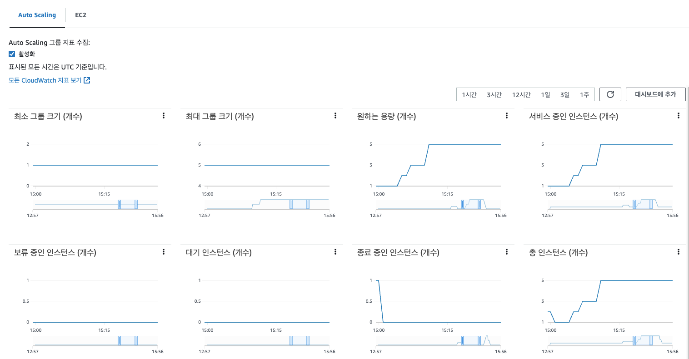
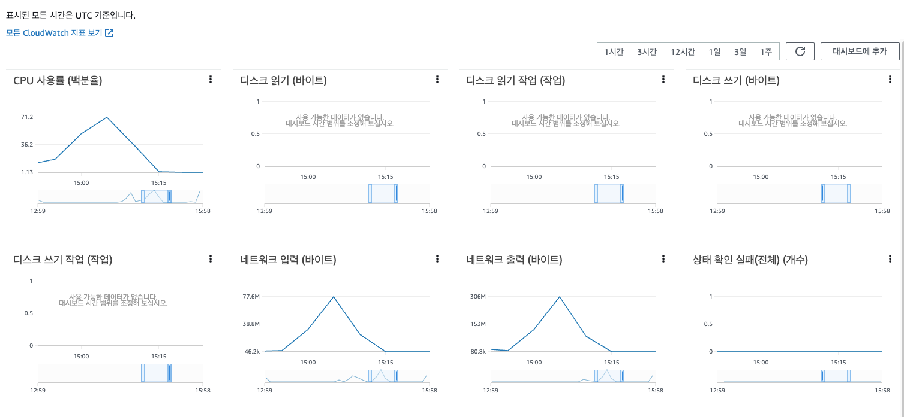
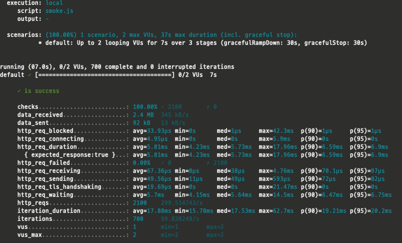
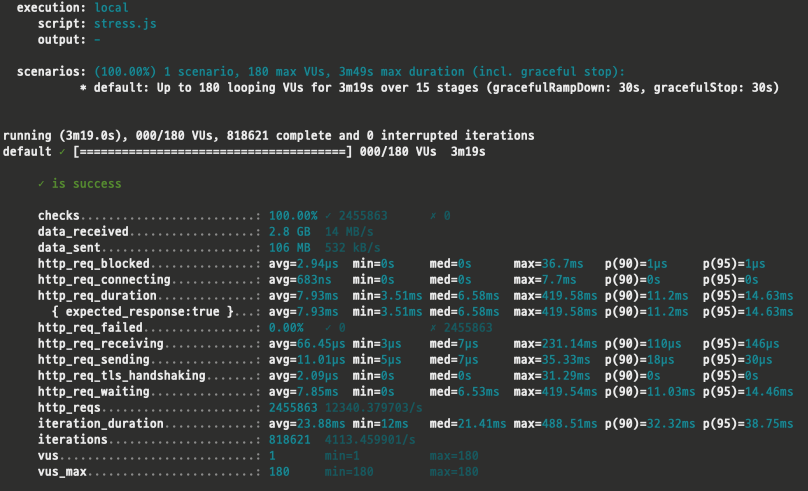
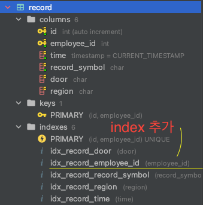
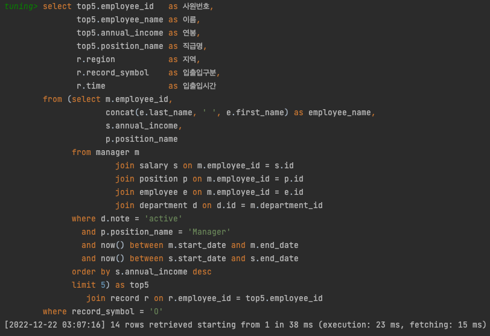
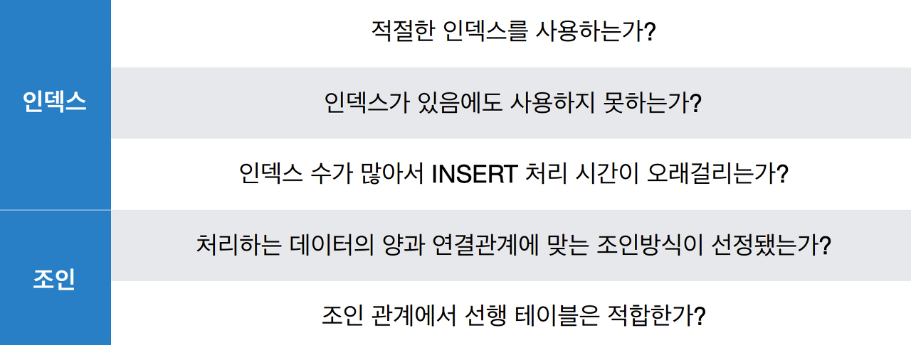

<p align="center">
    
</p>
<p align="center">
  
  
  <a href="https://edu.nextstep.camp/c/R89PYi5H" alt="nextstep atdd">
    
  </a>
  
</p>

<br>

# 인프라공방 샘플 서비스 - 지하철 노선도

<br>

## 🚀 Getting Started

### Install
#### npm 설치
```
cd frontend
npm install
```
> `frontend` 디렉토리에서 수행해야 합니다.

### Usage
#### webpack server 구동
```
npm run dev
```
#### application 구동
```
./gradlew clean build
```
<br>

## 미션

* 미션 진행 후에 아래 질문의 답을 작성하여 PR을 보내주세요.

--- 
### 1단계 - 화면 응답 개선하기
1. 성능 개선 결과를 공유해주세요 (Smoke, Load, Stress 테스트 결과)
- URL : https://yomni-subway.kro.kr/
- 테스트 결과는 monitoring/step1 하위에 모두 모아놓았습니다.
  - smoke / load / stress 각각 before / after 결과
  - Pagespeed 성능 테스트 before / after 결과

- Pagespeed 성능 테스트 결과 요약

|        | FCP      | LCP      | TTI      |
|--------|----------|----------|----------|
| Before | 2.6s     | 2.7s     | 2.7s     |
| After  | **1.2s** | **1.3s** | **1.3s** |
--> 대략 1/2 이하로 성능이 크게 개선되었습니다.

2. 어떤 부분을 개선해보셨나요? 과정을 설명해주세요

#### reverse-proxy 개선
- gzip 압축 : 텍스트 압축
- cache 설정 : nginx 의 cache 적용
- TLS, HTTP/2 설정 : http 1.1의 문제점인 HOL 블로킹 문제를 해결

#### WAS 성능 개선하기
- Spring Data Cache(with Redis)
  - 경로검색 기능에 Cache 적용
- 적절한 Thread pool size 구하기 : 사용 가능한 코어 수의 `1 ~ 2 배` 내로 수렴
  - CPU 모델명 : `Intel(R)Xeon(R) Platinum 8259CL CPU @2.50GHz`
  - CPU 당 물리 코어 수 : `1`
  - 물리 CPU 수 : `1`
  - 리눅스 전체 코어(프로세스) 개수 : `2`
  - AsyncThreadPool 적용

### 1단계 피드백
- [x] 구간별로 나눈 이유에 대한 확인
  - 구간별로 나눈 이유는 stress test 에서 터지는 시점의 데이터를 확인하기 용이하기 때문
  - load test 는 peak 까지 스무스하게 ramping up 하여, 오랜 시간동안 이상이 없는 지 확인하기 위함 
- [x] Async Thread pool은 생성했지만, `@Async`를 사용하는 곳이 없음
  - 아무리 생각해봐도 `@Async`를 적용할 곳이 없어서, 학습차원에서 AsyncThreadPool 만 구현 

---

### 2단계 - 스케일 아웃

1. Launch Template 링크를 공유해주세요.  
[yomni-template 입니다.](https://ap-northeast-2.console.aws.amazon.com/ec2/v2/home?region=ap-northeast-2#LaunchTemplateDetails:launchTemplateId=lt-0ad1e535b08ecca79)

2. cpu 부하 실행 후 EC2 추가생성 결과를 공유해주세요. (Cloudwatch 캡쳐)

EC2 추가 생성을 위해 VU 를 다소 많이 잡아서 부하 테스트를 진행했습니다.
peak VU = 5000 으로 설정하였습니다
```stress_peak.js
import http from 'k6/http';
import {check} from 'k6';

  export let options = {
    threshold: {
        http_req_duration: ['p(99)<100'],
    },
    stages: [
        {duration: '5s', target: 200}, // ramping up
        {duration: '30s', target: 200},
        {duration: '5s', target: 1000}, // ramping up
        {duration: '30s', target: 1000},
        {duration: '5s', target: 2000}, // ramping up
        {duration: '30s', target: 2000},

        {duration: '5s', target: 5000}, // stress peak
        {duration: '30s', target: 5000},

        {duration: '3s', target: 2000}, // ramping down
        {duration: '15s', target: 2000},
        {duration: '3s', target: 1000}, // ramping down
        {duration: '15s', target: 1000},
        {duration: '3s', target: 200}, // ramping down
        {duration: '15s', target: 200},
        {duration: '5s', target: 0}, // ramping down
    ],
  };
  ...
} 
```

- Auto - Scaling 캡처



- EC2 사용량 캡처



- 인스턴스 갯수 캡처


3. 성능 개선 결과를 공유해주세요 (Smoke, Load, Stress 테스트 결과)
- URL : https://yomni-subway.kro.kr/
- k6 test
  - smoke test  

  - load test  

  - stress test  


### 2단계 미션에 필요한 개념 정리

- 캐싱
  - HTTP 캐시는 불필요한 네트워크 요청을 줄이기 때문에 로드 성능을 향상시키는 효과적인 방법
  - 다만 무분별한 캐시는 변경된 리소스를 갱신하지 못하거나, 브라우저에 캐싱되어 있는 리소스가 민감정보인 경우는 보안상 취약점이 될 수도 있음
  - 이런 문제를 해결하고자 아래와 같은 절차로 캐싱 전략을 전개시켜야 함
    - 사용하기 전에 서버에서 재검증해야하는 리소스의 경우 : `Cache-Control: no-cache`
    - `보안`이나 기타 여러가지 이유로 `캐싱되지 않아야 하는 리소스`의 경우 : `Cache-Control: no-store`
    - 버전 지정된 리소스의 경우 `Cache-Control: max-age=31536000`
- ETag
  - 캐시된 응답에 대한 유효성 검사 수행
  - 서버는 ETag HTTP 헤더를 사용하여 유효성 검사 토큰을 전달함
  - 캐싱을 적절히 사용하며, 캐싱된 리소스에 대한 유효성 검사를 ETag HTTP 헤더를 사용
  - Etag 매커니즘
    1. Client 가 최초로 임의의 리소스를 요청
      - 서버는 이에 ETag 유효성 검사 토큰을 추가하여 리소스를 전달함(`20* 응답`)
      - Client 는 수신한 리소스를 브라우저 내에서 캐싱함
    2. ETag 유효성 토큰과 함께 동일한 리소스를 N 번째 요청
      - 서버에서는 ETag 토큰으로 리소스가 변경되었는 지 확인
      - 변경되지 않았다면 변경되지 않았다고 응답(`304 Not Modified`)

no-cache vs no-store  
- no-cache : 캐시를 저장함. 다만 **_리소스 사용 시점마다 서버에 재검증 요청_** 을 보낸다
- no-store : **_캐시를 절대 저장하지 않음_**, 가장 강력한 Cache-Control

public vs private
- public : 공유 캐시(CDN 등등..)에 저장 가능
- private : 브라우저같은 Client 환경에만 저장 가능

Cache-Control 정책 정의 알고리듬  

- 최대한 많이 / 오래 / 가까이 캐시해야 한다.
- 개인화된 컨텐츠, API 호출 등은 캐시하기 어렵다
- 캐시 주기는 특별한 이유가 없다면 1년 정도로 설정

정적 자원을 캐싱할 때의 문제점과 해결책
- 캐싱을 사용할 때의 문제 상황
  - js, css, image 와 같은 정적 파일은 배포 후에 변경이 발생하지 않음
  - 1년으로 캐싱 주기를 설정 (`max-age = 60 * 60 * 24 * 365`)
  - 다음 배포에서 js, css 일부 파일에 변경이 발생했다.
  - 브라우저에는 이전 버전의 파일이 캐싱되어 있어서 리소스 재요청을 보내지 않고 있다.
  - 어떻게 해결할 것인가?
    1. 배포 시간 / 버전 등을 활용해 리소스 요청의 URL 을 강제로 변경시킨다.
    2. 파일명을 변경하지 않으려면, 캐시 무효화 방식으로 해당 이미지만 업데이트 가능

배포 시간 또는 버전을 사용할 때의 문제 상황
- 서버에서 점진적으로 배포를 진행하고 있다.
- 만약 배포 진행중 as-is 내에 있는 old-main.js 에서 to-be 서버로 요청이 간다면?
- 기능에 따라 심각한 문제를 야기할 수도 있다.

- CDN 적용으로 점진적 배포시 문제 해결
  - CDN : Content Delivery Network ; 여러 노드를 가진 네트워크에 컨텐츠를 저장하여 제공하는 프록시의 일종
  - Client 와 비교적 가까운 곳에 위치하여 캐시된 컨텐츠를 전달하므로, RTT(Round Trip Time)이 줄어 컨텐츠를 빠르게 받을 수 있음
  - CDN 의 Edge 서버가 캐시된 컨텐츠를 전송하므로 원본 서버의 부하를 줄일 수 있다.
  - 인프라를 확충하는데 인력과 경비를 줄일 수 있다
  - CDN 서비스는 Edge 서버들간에 캐시를 공유하고 있다.

### 2단계 기능 목록
- [x] 모든 정적 자원에 대해 no-cache, private 설정을 하고 테스트 코드를 통해 검증한다.
- [x] 확장자가 `.css`인 경우, max-age를 1년, js인 경우는 no-cache, private 설정을 한다
- [x] 모든 정적 자원에 대해 no-cache, no-store 설정을 한다. 가능한가요?
  - **_가능합니다._** 
    - no-cache : 캐시를 저장함. 다만 **_리소스 사용 시점마다 서버에 재검증 요청_** 을 보낸다
    - no-store : **_캐시를 절대 저장하지 않음_**, 가장 강력한 Cache-Control
  - 따라서, no-cache, no-store 설정을 같이 한다는 것은 **_주먹을 쥐지 않고 모래를 잡는 방법을 찾아라_** 라고 주문하는 것과 같습니다.
  - 처음엔 불가능하다고 생각했지만, 착각이었습니다. 하지만 Spring의 CacheControl.java 내 javadoc 문서를 참고하자면,
  - `noStore`와 `noCache`의 차이점을 설명하고, 동시에 필요하지 않은 이유에 대해서 설명하고 있습니다.
  - 하지만, no-store, no-cache 를 강력한 통제 수단으로 함께 사용하기도 합니다.
  - [no-store 로도 충분할 것 같은데..](https://www.inflearn.com/questions/112647/no-store-%EB%A1%9C%EB%8F%84-%EC%B6%A9%EB%B6%84%ED%95%A0-%EA%B2%83-%EA%B0%99%EC%9D%80%EB%8D%B0-no-cache-must-revalidate-%EB%8A%94-%EC%99%9C-%EA%B0%99%EC%9D%B4-%EC%B6%94%EA%B0%80%ED%95%98%EB%8A%94-%EA%B2%83%EC%9D%B8%EA%B0%80%EC%9A%94)
- [x] SpringBoot 에 HTTP Cache, gzip 설정
- [x] Launch Template 작성하기
- [x] Auto Scaling Group 생성
- [x] Smoke, Load, Stress 테스트 후 결과를 기록

---

### 3단계 - 쿼리 최적화

1. 인덱스 설정을 추가하지 않고 아래 요구사항에 대해 1s 이하(M1의 경우 2s)로 반환하도록 쿼리를 작성하세요.

- 활동중인(Active) 부서의 현재 부서관리자 중 연봉 상위 5위안에 드는 사람들이 최근에 각 지역별로 언제 퇴실했는지 조회해보세요. (사원번호, 이름, 연봉, 직급명, 지역, 입출입구분, 입출입시간)
```mysql
# 실행시간 : 1 s 669 ms (M1 칩 사용자)
# 1. 활동중인(Active) 부서의 현재 부서관리자 중 연봉 상위 5위안에 드는 사람
select m.employee_id,
       concat(e.last_name, ' ', e.first_name) as name,
       s.annual_income,
       p.position_name
from manager m
         join salary s on m.employee_id = s.id
         join department d on d.id = m.department_id
         join position p on m.employee_id = p.id
         join employee e on m.employee_id = e.id
where d.note = 'active'
  and p.position_name = 'Manager'
  and now() between m.start_date and m.end_date
  and now() between s.start_date and s.end_date
order by s.annual_income desc
limit 5;

# 2. 활동중인(Active) 부서의 현재 부서관리자 중 연봉 상위 5위안에 드는 사람들이 최근에 각 지역별로 언제 퇴실했는지 조회해보세요. (사원번호, 이름, 연봉, 직급명, 지역, 입출입구분, 입출입시간)
select top5.employee_id                             as 사원번호,
       concat(top5.last_name, ' ', top5.first_name) as 이름,
       top5.annual_income                           as 연봉,
       top5.position_name                           as 직급명,
       record.region                                as 지역,
       record.record_symbol                         as 입출입구분,
       record.time                                  as 입출입시간
from (select manager.employee_id,
             employee.last_name,
             employee.first_name,
             salary.annual_income,
             position.position_name
      from manager manager
             join salary salary on manager.employee_id = salary.id
             join position position on manager.employee_id = position.id
             join employee employee on manager.employee_id = employee.id
             join department department on department.id = manager.department_id
      where department.note = 'active'
        and position.position_name = 'Manager'
        and manager.end_date = '9999-01-01'
        and now() between salary.start_date and salary.end_date
      order by salary.annual_income desc
      limit 5) as top5
       join record record on record.employee_id = top5.employee_id
where record_symbol = 'O';

# [2022-12-22 03:01:18] 14 rows retrieved starting from 1 in 1 s 684 ms (execution: 1 s 669 ms, fetching: 15 ms)
```

- Explain plan  


### 추가) Index 튜닝
- 현재 실행계획 상 가장 많은 비용이 발생하는 구간은 record 에 대한 인덱스가 적절히 걸려있지 않기 때문입니다.
- record 의 employee_id 에 index 를 걸게 되면 실행 속도가 현저히 줄어듭니다.

  
  

### 결론
적절히 index 를 걸어 주면, 쿼리 속도가 드라마틱하게 개선될 수 있다.
- indexing 전 = 실행시간 : **_1 s 669 ms_** (M1 칩 사용자)
- indexing 후 = 실행시간 : **_23ms_** (M1 칩 사용자)


#### 3단계 피드백
- [x] manager.end_date의 경우 `9999-01-01` 로 조회 시 성능 개선의 여지가 있음
- [x] 서브쿼리에서 concat을 적용하기보단, 최종 select 에서 작성 하는 것이 성능 개선의 여지가 있음

---

### 4단계 - 인덱스 설계

1. 인덱스 적용해보기 실습을 진행해본 과정을 공유해주세요  
- Indexing Checklist  


  
#### 4단계 기능 목록
- [x] 주어진 데이터 셋을 활용하여 아래 조회 결과를 100ms 이하로 반환
  - M1의 경우엔 2배를 기준으로 진행, 어렵다면 일단 리뷰 요청
 
1. [x] [Coding as a Hobby](https://insights.stackoverflow.com/survey/2018#developer-profile-_-coding-as-a-hobby) 와 같은 결과를 반환할 것
```mysql
select hobby, ROUND(count(hobby) / (select count(hobby) as total from programmer) * 100, 1) as 응답
from programmer
group by hobby
order by hobby desc;
# 실행결과 : 4 s 869 ms (execution: 4 s 815 ms, fetching: 54 ms)
```  

- 조치 전 실행 계획  


- 문제점
  - 적절한 인덱스가 없어서, 사용하지 못하고 있다.
- 조치
  1. id를 PK로 지정
  ```mysql
  alter table programmer add constraint programmer_pk primary key (id);
  ```
  2. hobby 단일 컬럼 인덱스 설정
  ```mysql
  create index idx_hobby_programmer on programmer (hobby);
  ```
  3. 조치 후 쿼리 속도 개선
  ```mysql
  # before : 4 s 869 ms (execution: 4 s 815 ms, fetching: 54 ms)
  # after: 306 ms (execution: 295 ms, fetching: 11 ms)
  ```

- 조치 후 실행계획  


2. [x] 프로그래머별로 해당하는 병원 이름을 반환하세요 (covid.id, hospital.name)
```mysql
# full fetch
select c.id, h.name
from hospital h
    join covid c on h.id = c.hospital_id
    join programmer p on p.id = c.programmer_id
# 96,180 rows retrieved starting from 1 in 4 s 965 ms (execution: 40 ms, fetching: 4 s 925 ms)
```

- 조치 전 실행 계획  
  

- 문제점
  - 적절한 인덱스가 없어서, 사용하지 못하고 있다.
- 조치
  1. covid, hospital id를 PK로 지정
  ```mysql
  alter table covid add constraint pk_id_covid primary key (id);
  alter table hospital add constraint pk_id_hospital primary key (id);
  ```
    2. covid 가 관여하는 컬럼들에 대해 단일 컬럼 인덱스 설정(hospital_id, programmer_id)
  ```mysql
  create index idx_hospital_id_covid on covid (hospital_id);
  create index idx_programmer_id_covid on covid (programmer_id);
  ```
    3. 조치 후 쿼리 속도 개선
  ```mysql
  # full fetch 기준
  # before : 4 s 965 ms (execution: 40 ms, fetching: 4 s 925 ms)
  # after: 2 s 154 ms (execution: 45 ms, fetching: 2 s 109 ms)
  ```
  
- 조치 후 실행 계획  


3. [x] 프로그래밍이 취미인 학생 혹은 주니어(0~2년) 들이 다닌 병원 이름을 반환하고, user.id 기준으로 정렬하세요.  
(covid.id, hospital.name, user.Hobby, user.DevType, userYearsCoding)

```mysql
# full fetch
select c.id, h.name, p.hobby, p.dev_type, p.years_coding
from programmer p
       join covid c on p.id = c.programmer_id
       join hospital h on c.hospital_id = h.id
where hobby = 'YES'
  and (years_coding = '0-2 years' or (student = 'Yes, part-time' and student = 'Yes, full-time'))
# 8,169 rows retrieved starting from 1 in 3 s 674 ms (execution: 87 ms, fetching: 3 s 587 ms)
```  

- 조치 전 실행 계획  
  

- 문제점
  - 적절한 인덱스가 없어서, 사용하지 못하고 있다.
- 조치
  1. programmer, hospital 의 적절한 index 추가
  ```mysql
  create index idx_hobby_student_years_coding_programmer on programmer (hobby, student ,years_coding);
  create index idx_id_name_hospital on hospital (id, name);
  ```
  2. 조치 후 쿼리 속도 개선
  ```mysql
  # full fetch 기준
  # before : 4 s 499 ms (execution: 81 ms, fetching: 4 s 418 ms)
  # after: 3 s 584 ms (execution: 125 ms, fetching: 3 s 459 ms)
  ```

- 조치 후 실행계획  
  

4. [x] 서울대병원에 다닌 20대 India 환자들을 병원에 머문 기간별로 집계(covid.Stay)
```mysql
select covid.stay AS 입원기간, count(covid.programmer_id) AS 집계결과
from member
    join programmer on member.id = programmer.member_id
    join covid on programmer.id = covid.programmer_id
    join hospital on covid.hospital_id = hospital.id
where hospital.name = '서울대병원'
  and programmer.country = 'India'
  and member.age between 20 and 29
group by covid.stay
# 10 rows retrieved starting from 1 in 1 s 311 ms (execution: 1 s 283 ms, fetching: 28 ms)
```  

- 조치 전 실행 계획  
  

- 문제점
  - 적절한 인덱스가 없어서, 사용하지 못하고 있다.
- 조치
  1. member pk 추가
  ```mysql
  alter table member add constraint pk_id_member primary key (id);
  ```
  2. member, programmer 의 적절한 index 추가
  ```mysql
  create index idx_age_member on member (age);
  create index idx_country_programmer on programmer (country);
  create index idx_member_id_programmer on programmer (member_id);
  ```
  3. 조치 후 쿼리 속도 개선
  ```mysql
  # full fetch 기준
  # before : 1 s 311 ms (execution: 1 s 283 ms, fetching: 28 ms)
  # after: 129 ms (execution: 98 ms, fetching: 31 ms)
  ```

- 조치 후 실행계획  
  


5. [x] 서울대병원에 다닌 30대 환자들을 운동 횟수별로 집계 (user.Exercise)
```mysql
select programmer.exercise as 운동회수, count(programmer_id) as 인원집계
from hospital
       join covid on hospital.id = covid.hospital_id
       join member on covid.member_id = member.id
       join programmer on member.id = programmer.member_id
where hospital.name = '서울대병원'
  and member.age between 30 and 39
group by programmer.exercise
# 5 rows retrieved starting from 1 in 175 ms (execution: 146 ms, fetching: 29 ms)
```  

- 실행 계획  
  

- 연관된 컬럼이 모두 인덱싱되어 있으므로, 이번 단계에서는 딱히 조치해야할 내용이 없습니다.  
  (모든 체크리스트 통과)

---

### 추가 미션

1. 페이징 쿼리를 적용한 API endpoint를 알려주세요
