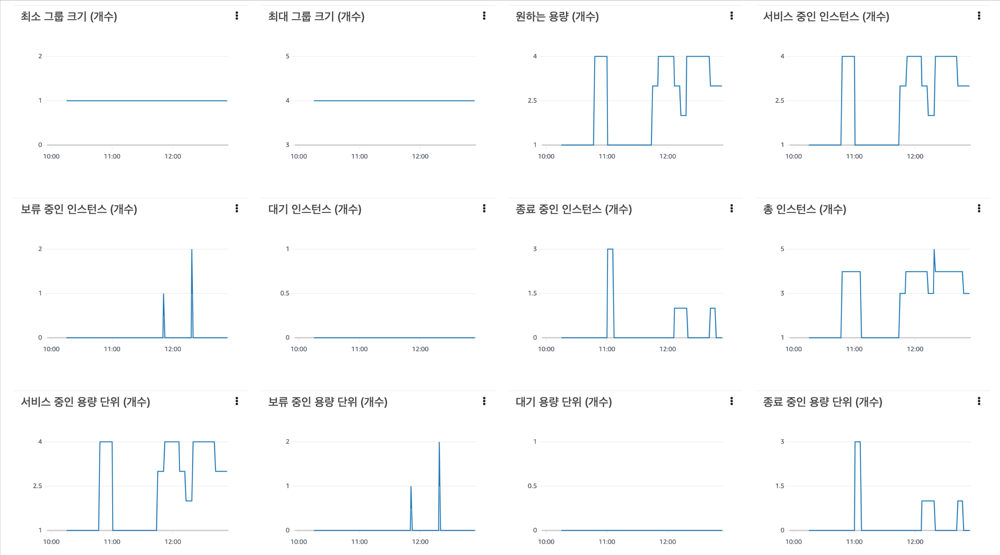
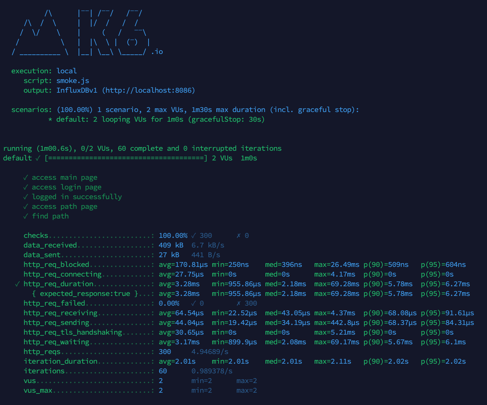
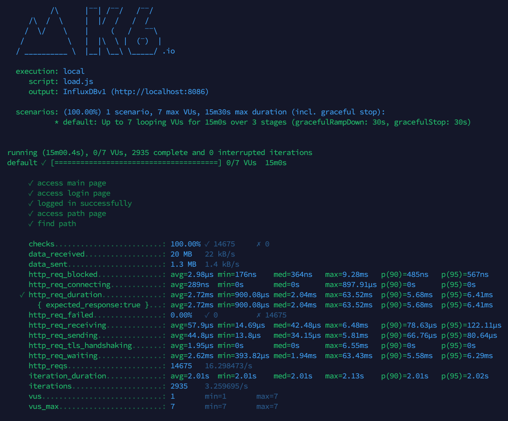
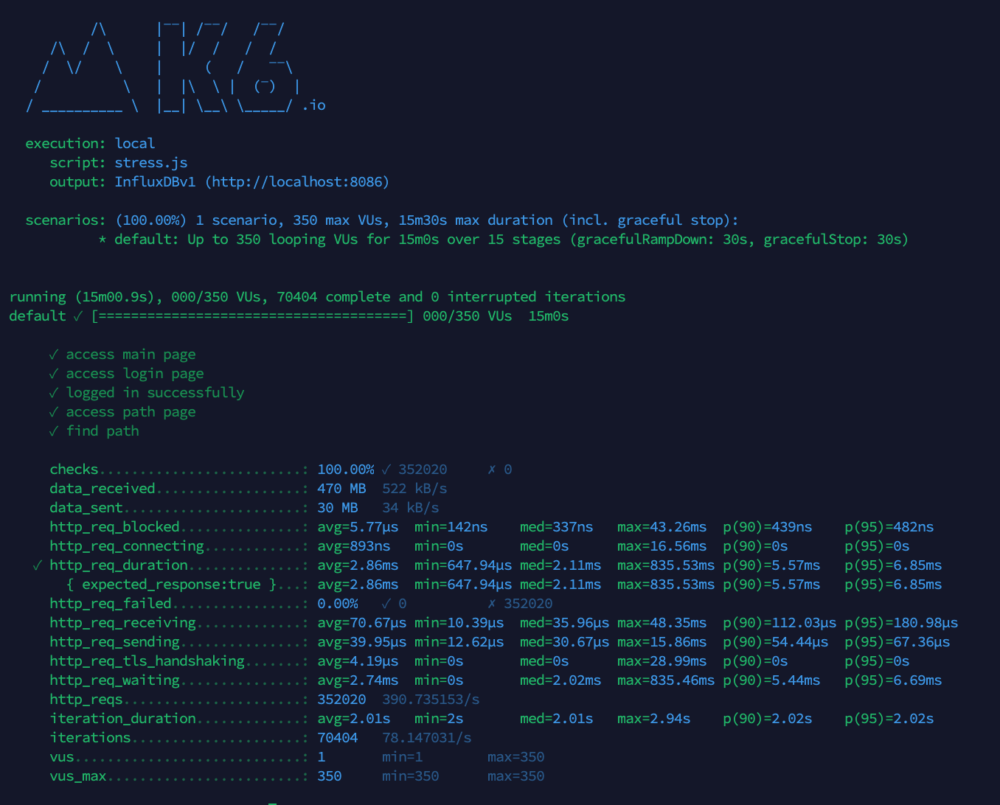

<p align="center">
    
</p>
<p align="center">
  
  
  <a href="https://edu.nextstep.camp/c/R89PYi5H" alt="nextstep atdd">
    
  </a>
  
</p>

<br>

# 인프라공방 샘플 서비스 - 지하철 노선도

<br>

## 🚀 Getting Started

### Install
#### npm 설치
```
cd frontend
npm install
```
> `frontend` 디렉토리에서 수행해야 합니다.

### Usage
#### webpack server 구동
```
npm run dev
```
#### application 구동
```
./gradlew clean build
```
<br>

## 미션

* 미션 진행 후에 아래 질문의 답을 작성하여 PR을 보내주세요.


### 1단계 - 화면 응답 개선하기
1. 성능 개선 결과를 공유해주세요 (Smoke, Load, Stress 테스트 결과)
   - resources/docs/load
   - resources/docs/smoke
   - resources/docs/stress
   - https://subway.sixthou.kro.kr/
2. 어떤 부분을 개선해보셨나요? 과정을 설명해주세요
  - 리버스 프록시개선과 was성능개선 두가지 스탭으로 나눠서 진행했습니다.
  - 리버스 프로시개선
    - gzip, cache, tls, https/2
  - was 성능개선
    - redis 설정
    
#### 요구사항
- [x] 부하테스트 각 시나리오의 요청시간을 목푯값 이하로 개선 
  - [x] 개선 전 / 후를 직접 계측하여 확인
---

### 2단계 - 스케일 아웃

1. Launch Template 링크를 공유해주세요.
    - [링크](https://ap-northeast-2.console.aws.amazon.com/ec2/home?region=ap-northeast-2#LaunchTemplateDetails:launchTemplateId=lt-0b4895710bf98580b)
```
#!/bin/bash

sudo apt-get update
sudo apt -y install default-jre
sudo apt -y install openjdk-8-jre-headless

sudo apt install unzip 
curl "https://awscli.amazonaws.com/awscli-exe-linux-x86_64.zip" -o "awscliv2.zip"
unzip awscliv2.zip
sudo ./aws/install

sudo apt-get update && \
sudo apt-get install -y apt-transport-https ca-certificates curl software-properties-common && \
curl -fsSL https://download.docker.com/linux/ubuntu/gpg | sudo apt-key add - && \
sudo apt-key fingerprint 0EBFCD88 && \
sudo add-apt-repository "deb [arch=amd64] https://download.docker.com/linux/ubuntu $(lsb_release -cs) stable" && \
sudo apt-get update && \
sudo apt-get install -y docker-ce && \
sudo usermod -aG docker ubuntu && \
sudo curl -L https://github.com/docker/compose/releases/download/v2.9.0/docker-compose-linux-x86_64 -o /usr/local/bin/docker-compose && \
sudo chmod +x /usr/local/bin/docker-compose && \
sudo ln -s /usr/local/bin/docker-compose /usr/bin/docker-compose

sudo mkdir -p /home/ubuntu/app
sudo mkdir -p /home/ubuntu/data/log
sudo chown -R ubuntu:ubuntu /home/ubuntu/app
sudo chown -R ubuntu:ubuntu /home/ubuntu/data/log

sudo -i -u ubuntu aws s3 cp s3://nextstep-camp-pro/sixthou-deploy.sh /home/ubuntu/app
sudo -i -u ubuntu chmod 755 /home/ubuntu/app/sixthou-deploy.sh 
sudo -i -u ubuntu /bin/bash /home/ubuntu/app/sixthou-deploy.sh step2 prod
```
2. cpu 부하 실행 후 EC2 추가생성 결과를 공유해주세요. (Cloudwatch 캡쳐)

```sh
$ stress -c 2
```
3. 성능 개선 결과를 공유해주세요 (Smoke, Load, Stress 테스트 결과)
- smoke
  
- load
  
- stress
  

#### 요구사항
- [x] springboot에 HTTP Cache, gzip 설정하기
- [x] Launch Template 작성하기
- [x] Auto Scaling Group 생성하기
- [x] Smoke, Load, Stress 테스트 후 결과를 기록

#### 미션 요구사항
미션1: 모든 정적 자원에 대해 no-cache, private 설정을 하고 테스트 코드를 통해 검증합니다.
미션2: 확장자는 css인 경우는 max-age를 1년, js인 경우는 no-cache, private 설정을 합니다.
미션3: 모든 정적 자원에 대해 no-cache, no-store 설정을 한다. 가능한가요?
- no-cache
  - 캐시를 하지말라는 것이아니라 캐싱된 복사본을 사용자에게 보여주기 이전에, 재검증을 위한 요청을 원 서버로 보내도록 강제 복사본을 사용해도 되는지 확인을 하라는 옵션입니다.
- no-store
  - 클라이언트 요청 혹은 서버 응답에 관해서 어떤 것도 캐싱하지 않습니다.
- must-revalidate
  - 캐시는 사용하기 이전에 기존 리소스의 상태를 반드시 확인하고 만료된 리소스는 사용하지 않습니다.

no-store 옵션만으로도 캐시가 무효화되어야 하는것이 맞으나, 버그 및 구버전과의 호한성을 위해 위 3가지 옵션을 함께 가져갑니다. 아래와 같이 설정하면 가능하다고 생각합니다!

```java
registry.addResourceHandler(PREFIX_STATIC_RESOURCES + "/" + version.getVersion() + "/**")
        .addResourceLocations("classpath:/static/")
        .setCacheControl(CacheControl.noCache().cachePrivate())
        .setCacheControl(CacheControl.noStore().mustRevalidate());
```

- 참고
  - [how-do-we-control-web-page-caching-all-browsers](https://stackoverflow.com/questions/49547/how-do-we-control-web-page-caching-across-all-browsers)
  - [no-store 로도 충분할 것 같은데...](https://www.inflearn.com/questions/112647/no-store-%EB%A1%9C%EB%8F%84-%EC%B6%A9%EB%B6%84%ED%95%A0-%EA%B2%83-%EA%B0%99%EC%9D%80%EB%8D%B0-no-cache-must-revalidate-%EB%8A%94-%EC%99%9C-%EA%B0%99%EC%9D%B4-%EC%B6%94%EA%B0%80%ED%95%98%EB%8A%94-%EA%B2%83%EC%9D%B8%EA%B0%80%EC%9A%94#84841)
  - [Cache-Control](https://developer.mozilla.org/ko/docs/Web/HTTP/Headers/Cache-Control)
---
### 3단계 - 쿼리 최적화

1. 인덱스 설정을 추가하지 않고 아래 요구사항에 대해 1s 이하(M1의 경우 2s)로 반환하도록 쿼리를 작성하세요.
- 활동중인(Active) 부서의 현재 부서관리자 중 연봉 상위 5위안에 드는 사람들이 최근에 각 지역별로 언제 퇴실했는지 조회해보세요. (사원번호, 이름, 연봉, 직급명, 지역, 입출입구분, 입출입시간)
- 쿼리
    ```sql
    select mem.id            사원번호,
           mem.last_name     이름,
           mem.annual_income 연봉,
           mem.position_name 직급명,
           r.time            입출국시간,
           r.region          지역,
           r.record_symbol   입출국구분
    from record r
             inner join (select e.id,
                                e.last_name,
                                s.annual_income,
                                p.position_name
                         from employee e
                                  inner join employee_department ed on e.id = ed.employee_id
                                  inner join department d on ed.department_id = d.id
                                  inner join manager m on d.id = m.department_id and e.id = m.employee_id
                                  inner join salary s on s.id = e.id
                                  inner join position p on p.id = e.id
                         where d.note = 'active'
                           and m.end_date > now()  and m.start_date <= now()
                           and ed.end_date > now() and ed.start_date <= now()
                           and s.end_date > now()  and s.start_date <= now()
                           and p.end_date > now() and s.start_date <= now()
                           and p.position_name = 'Manager'
                         order by annual_income desc
                             limit 5) as mem on r.employee_id = mem.id
    where record_symbol = 'O'
    ```
- 실행결과
  - 
- 응답시간(M1)
  -  
#### 요구사항
- [x] 활동중인(Active) 부서의 현재 부서관리자(manager) 중 연봉 상위 5위안에 드는 사람들이 최근에 각 지역별로 언제 퇴실(O)했는지 조회
- [x] 인덱스 설정을 추가하지 않고 200ms 이하로 반환합니다.
  - M1의 경우엔 시간 제약사항을 달성하기 어렵습니다.
- [x] 급여 테이블의 사용여부 필드는 사용하지 않습니다. 현재 근무중인지 여부는 종료일자 필드로 판단해주세요.

---

### 4단계 - 인덱스 설계

1. 인덱스 적용해보기 실습을 진행해본 과정을 공유해주세요

---

### 추가 미션

1. 페이징 쿼리를 적용한 API endpoint를 알려주세요
