<p align="center">
    
</p>
<p align="center">
  
  
  <a href="https://edu.nextstep.camp/c/R89PYi5H" alt="nextstep atdd">
    
  </a>
  
</p>

<br>

# 인프라공방 샘플 서비스 - 지하철 노선도

<br>

## 🚀 Getting Started

### Install

#### npm 설치

```
cd frontend
npm install
```

> `frontend` 디렉토리에서 수행해야 합니다.

### Usage

#### webpack server 구동

```
npm run dev
```

#### application 구동

```
./gradlew clean build
```

<br>

## 미션

* 미션 진행 후에 아래 질문의 답을 작성하여 PR을 보내주세요.

### 1단계 - 화면 응답 개선하기

1. 성능 개선 결과를 공유해주세요 (Smoke, Load, Stress 테스트 결과)

* Smoke
    * 개선전
      
    * 1차 개선 후 (Reverse Proxy 개선)
      
    * 2차 개선 후 (Spring DAta Cache 적용)
      
* Load
    * 개선전
      
    * 1차 개선 후 (Reverse Proxy 개선)
      
    * 2차 개선 후 (Spring DAta Cache 적용)
      
* Stress
    * 개선전
      
    * 1차 개선 후 (Reverse Proxy 개선)
      
    * 2차 개선 후 (Spring DAta Cache 적용)
      

2. 어떤 부분을 개선해보셨나요? 과정을 설명해주세요

* Reverse Proxy 개선
    * gzip 압축
    * cache
    * http/2 설정
* WAS 성능 개선
    * Spring Data Cache
        * 가장 많이 쓰이는 최단 경로 조회 기능에 적용

---

### 2단계 - 스케일 아웃

* 미션 요구사항
    * [X] 미션1: 모든 정적 자원에 대해 no-cache, private 설정을 하고 테스트 코드를 통해 검증합니다.
    * [X] 미션2: 확장자는 css인 경우는 max-age를 1년, js인 경우는 no-cache, private 설정을 합니다.
    * [X] 미션3: 모든 정적 자원에 대해 no-cache, no-store 설정을 한다. 가능한가요?
        * 데이터 유출을 막을 필요(no-store)가 있고 최신 상태로 유지할 필요(no-cache)가 있다면 가능합니다!

1. Launch Template 링크를 공유해주세요.

* https://ap-northeast-2.console.aws.amazon.com/ec2/v2/home?region=ap-northeast-2#LaunchTemplateDetails:launchTemplateId=lt-07d5024625b8e0525

2. cpu 부하 실행 후 EC2 추가생성 결과를 공유해주세요. (Cloudwatch 캡쳐)

```sh
$ stress -c 2
```

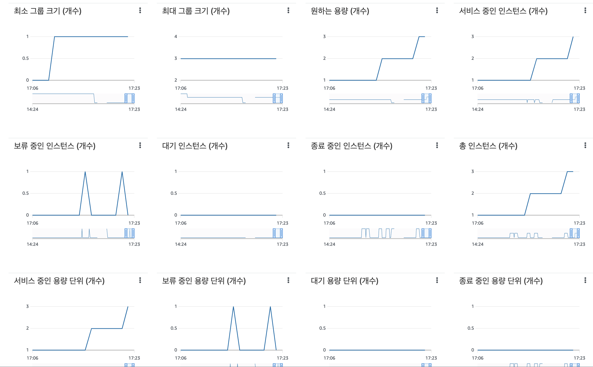

* Target Group Health Check 이슈 수정 결과
  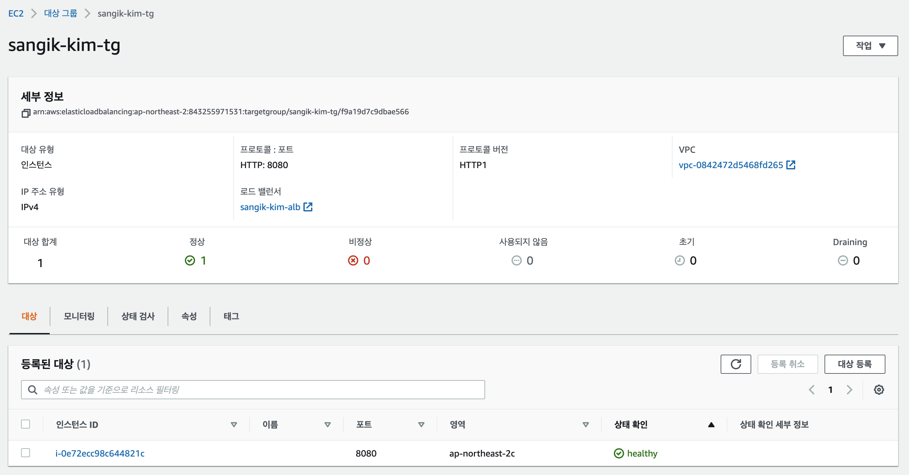

3. 성능 개선 결과를 공유해주세요 (Smoke, Load, Stress 테스트 결과)

* Smoke
  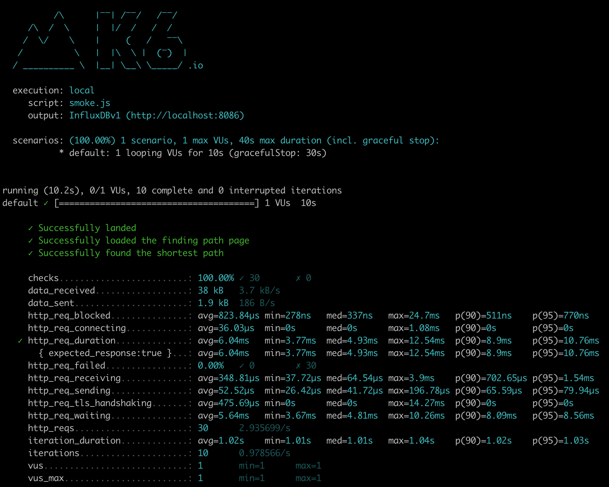

* Load
  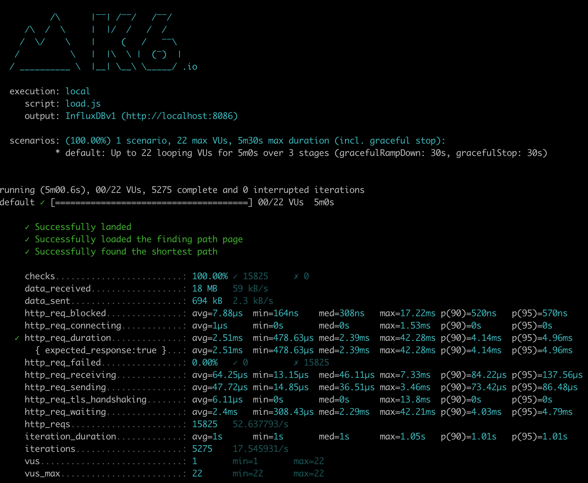

* Stress
  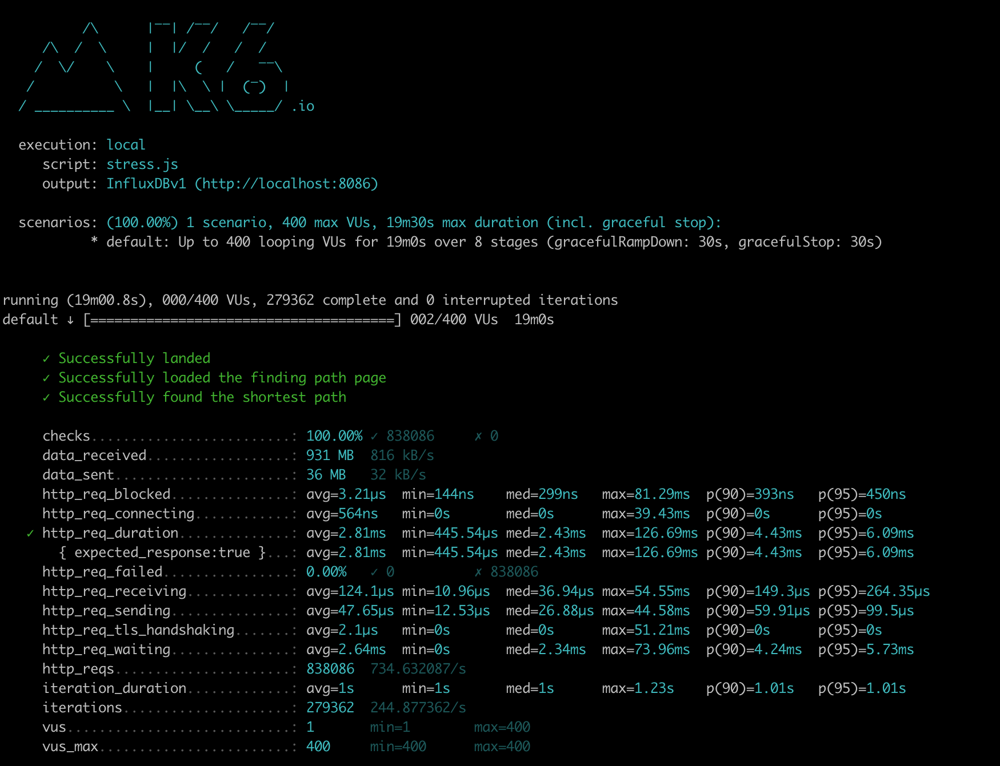

---

### 1단계 - 쿼리 최적화

1. 인덱스 설정을 추가하지 않고 아래 요구사항에 대해 1s 이하(M1의 경우 2s)로 반환하도록 쿼리를 작성하세요.

- 활동중인(Active) 부서의 현재 부서관리자 중 연봉 상위 5위안에 드는 사람들이 최근에 각 지역별로 언제 퇴실했는지 조회해보세요. (사원번호, 이름, 연봉, 직급명, 지역, 입출입구분, 입출입시간)

```sql
select skm.id            as `사원번호`,
       skm.last_name     as `이름`,
       skm.annual_income as `연봉`,
       skm.position_name as `직급명`,
       r.`time`          as `입출입시간`,
       r.region          as `지역`,
       r.record_symbol   as `입출입구분`
from (
         select e.id,
                e.last_name,
                s.annual_income,
                p.position_name
         from (
                  select employee_id,
                         department_id
                  from manager
                  where end_date > now()
              ) m
                  inner join (
             select id
             from department
             where lower(note) = 'active'
         ) d on m.department_id = d.id
                  inner join employee e on m.employee_id = e.id
                  inner join position p on m.employee_id = p.id
                  inner join (
             select id,
                    annual_income
             from salary
             where end_date > now()
         ) s on m.employee_id = s.id
         where p.position_name = 'Manager'
         order by s.annual_income desc limit 
      5
     ) skm
         inner join (
    select employee_id,
           `time`,
           region,
           record_symbol
    from record
    where record_symbol = 'O'
) r on r.employee_id = skm.id;

```

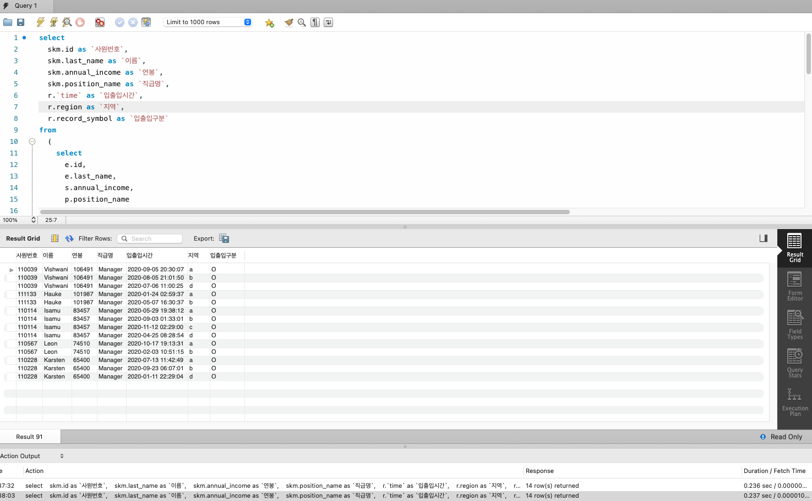


---

### 2단계 - 인덱스 설계

1. 인덱스 적용해보기 실습을 진행해본 과정을 공유해주세요

#### 요구사항

* 주어진 데이터셋을 활용하여 아래 조회 결과를 100ms 이하로 반환
    * M1의 경우엔 시간 제약사항을 달성하기 어렵습니다. 2배를 기준으로 해보시고 어렵다면, 일단 리뷰요청 부탁드려요


* [X] Coding as a Hobby 와 같은 결과를 반환하세요.
  ```sql
  select hobby, 
      round(count(*) / (select count(*) as total from programmer) * 100, 1) as percent
  from programmer
  group by hobby;
  ```
  #### 1. 초기 상태 (Duration): 2.026 sec
  

  #### 2. `programmer.hobby` 인덱스 설정 (Duration): 0.069 sec
  ```sql
  CREATE INDEX `idx_programmer_hobby`  ON `subway`.`programmer` (hobby) COMMENT '' ALGORITHM DEFAULT LOCK DEFAULT
  ```
  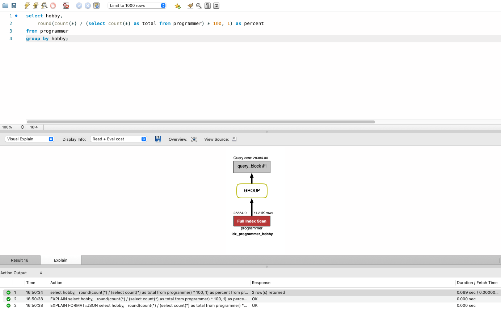

  #### 3. `programmer.id` PK 설정 (Duration): 0.044 sec
  ```sql
  ALTER TABLE `subway`.`programmer` 
  CHANGE COLUMN `id` `id` BIGINT(20) NOT NULL ,
  ADD PRIMARY KEY (`id`);
  ```
  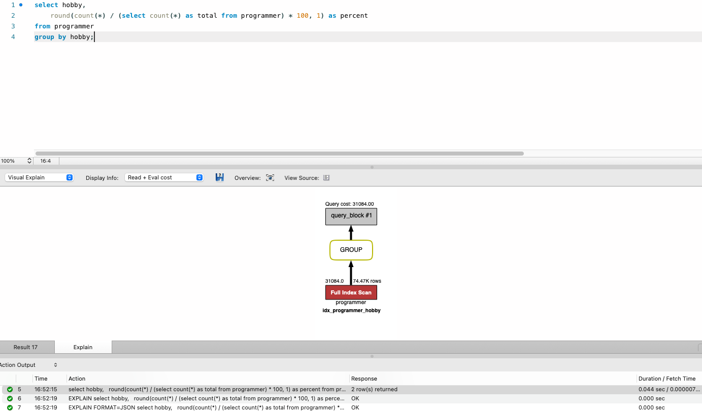

  #### 첫번째 요구사항 관련 질문

  > 해당 인덱스의 explain plan을 보면 plan이 동일하네요....! 시간이 줄어들긴 했지만 우연히 줄어든 것으로보이고, 실제 성능 향상은 없었던 것 같습니다! 성능 차이가 미세하여 직접 확인은 어렵겠지만, 쿼리를 여러번 수행하다보면 수행 시간이 달라질 것으로 보입니다!

    - 말씀하신것 처럼 `실행계획`이 동일해 보일 수 있지만, 참조하는 `row` 수에 차이()가 있습니다. 즉, PK 추가여부가 내부적으로 데이터 접근에 영향을 미쳤다는걸 알 수 있습니다. 추측하신것을 검증하기
      위해 해당 쿼리를 여러번 실행해 본 결과 두 쿼리 성능 차이는 아래와 같이 분명히 존재합니다.
        - PK 설정 전: rows = 74,465
        - PK 설정 후: rows = 71,210
          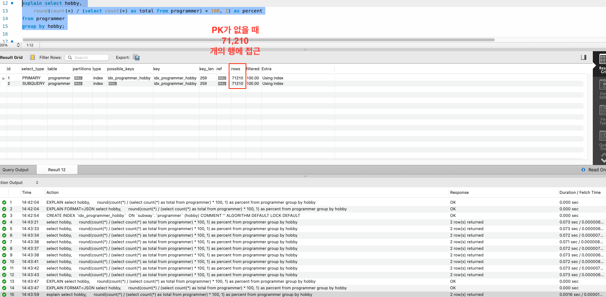
          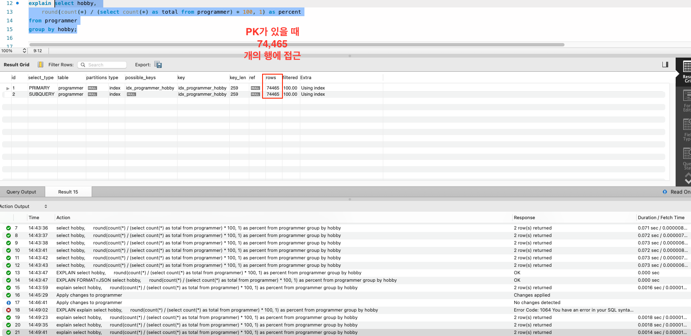
          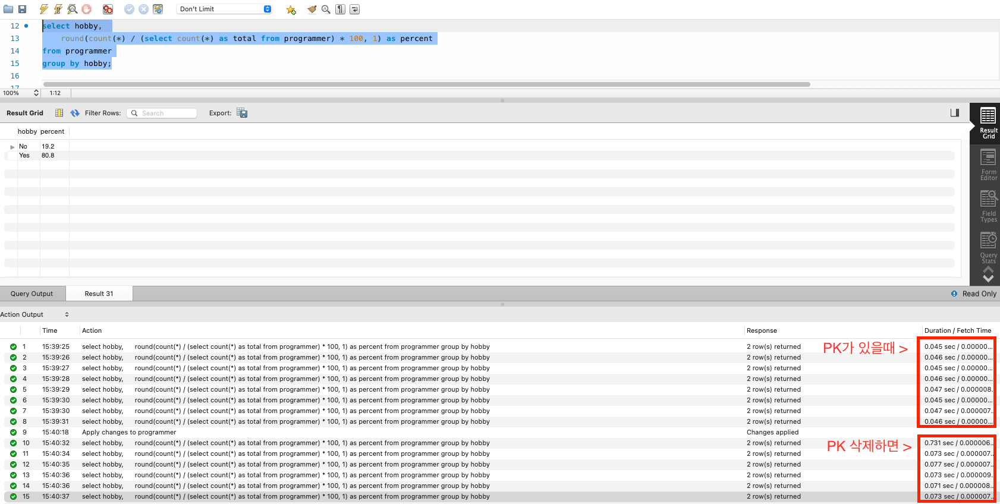

----

* [X] 프로그래머별로 해당하는 병원 이름을 반환하세요. (covid.id, hospital.name)
  ```sql
  select p.id, h.`name`
  from programmer p
  inner join covid c on p.id = c.programmer_id
  inner join hospital h on c.hospital_id = h.id;
  ```

  #### 1. 초기 상태 (Duration / Fetch Time): 0.0074 sec / 2.553 sec
  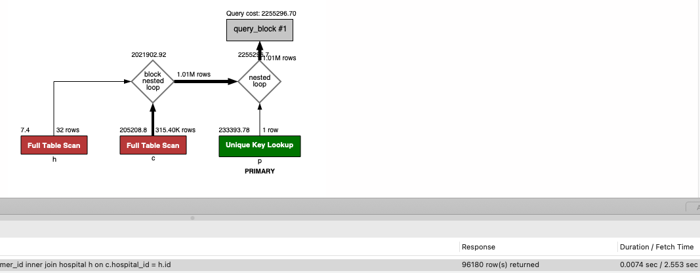

  #### 2. 인덱스 설정 (Duration / Fetch Time): 0.0064 sec / 0.362 sec
    * `covid.programmer_id` 인덱스 추가
    * `hospital.id` PK 설정
      ```sql
      CREATE INDEX `idx_covid_programmer_id`  ON `subway`.`covid` (programmer_id) COMMENT '' ALGORITHM DEFAULT LOCK DEFAULT

      ALTER TABLE `subway`.`hospital` 
      CHANGE COLUMN `id` `id` INT(11) NOT NULL ,
      ADD PRIMARY KEY (`id`);
      ```
      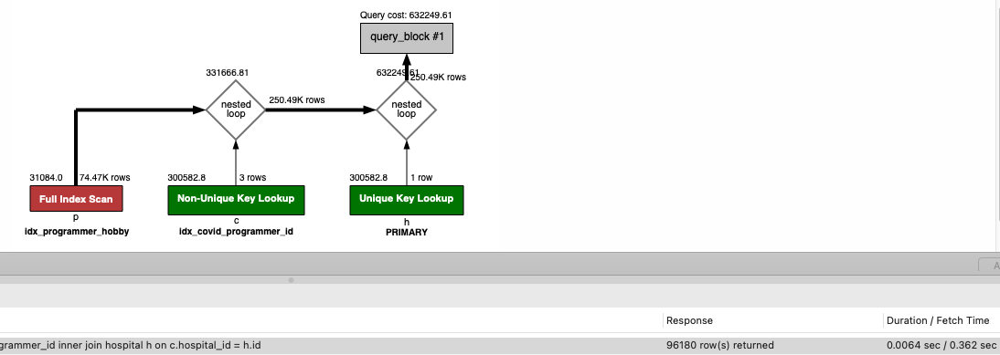

  #### 3. `covid.id` PK 설정 (Duration / Fetch Time): 0.0054 sec / 0.372 sec
  ```sql
  ALTER TABLE `subway`.`covid` 
  CHANGE COLUMN `id` `id` BIGINT(20) NOT NULL ,
  ADD PRIMARY KEY (`id`);
  ```
  

  #### 두번째 요구사항 관련 질문

  > 여기도 pk 설정이 plan에 유효한 영향을 준 것 같아보이지는 않습니다!

    - 말씀하신것 처럼 `covid.id`를 `PK`로 지정했지만, 아래와 같이 완전히 동일한 `실행계획`을 볼 수 있고 실제 성능에서도 차이가 없어서 다른 접근 방법으로 가야할 것 같네요.
      
      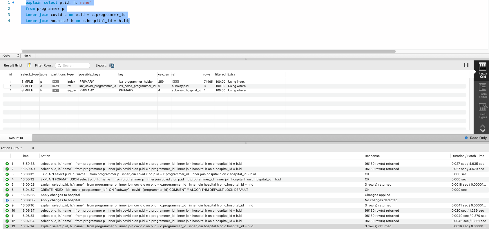
      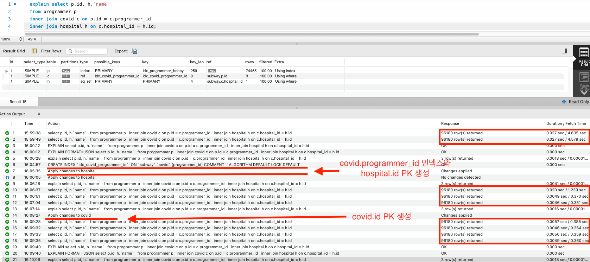

    - 이 부분을 더 향상할 방법이 없을까 고민하다 앞에서 설정한 인덱스 `idx_covid_programmer_id`를 `porgrammer_id, hospital_id`로 변경을 해봤지만 `실행계획`
      에서 `covid` 테이블의 `extra` 값에 `Using index`가 추가된것을 확인했지만 성능이 좋아지진 않았네요. 성능을 더 올리기위해 어떤 방법이 있을까요?
      ```sql
      ALTER TABLE `subway`.`covid` 
      DROP INDEX `idx_covid_programmer_id` ,
      ADD INDEX `idx_covid_programmer_id` (`programmer_id` ASC, `hospital_id` ASC);
      ```
      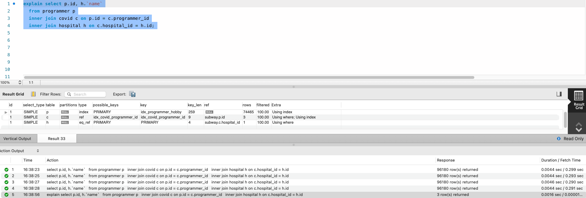

----

* [X] 프로그래밍이 취미인 학생 혹은 주니어(0-2년)들이 다닌 병원 이름을 반환하고 ~~user.id~~ `programmer.id` 기준으로 정렬하세요. (covid.id, hospital.name, ~~
  user.Hobby~~ programmer.hobby, ~~user.DevType~~ programmer.dev_type, ~~user.YearsCoding~~ programmer.years_coding)
    ```sql
    select c.id, h.`name`, p.hobby, p.dev_type, p.years_coding
    from (
        select p.id, p.hobby, p.dev_type, p.years_coding
        from programmer p
        where hobby = 'Yes'
          and (student in ('Yes, part-time', 'Yes, full-time')
               or years_coding = '0-2 years')
        ) p
    inner join covid c on p.id = c.programmer_id
    inner join hospital h on c.hospital_id = h.id
    order by p.id;
    ```
  #### 1. 초기 상태 (Duration / Fetch Time): 0.015 sec / 3.087 sec
    * 위 요구사항을 만족하려 생성한 인덱스를 사용하여 별도의 인덱스 설정을 하지 않았습니다.
    * ~~별도로 정렬하지 않은 이유는 이미 `programer.id`를 PK로 설정되어 따로 정렬하지 않았습니다.~~
      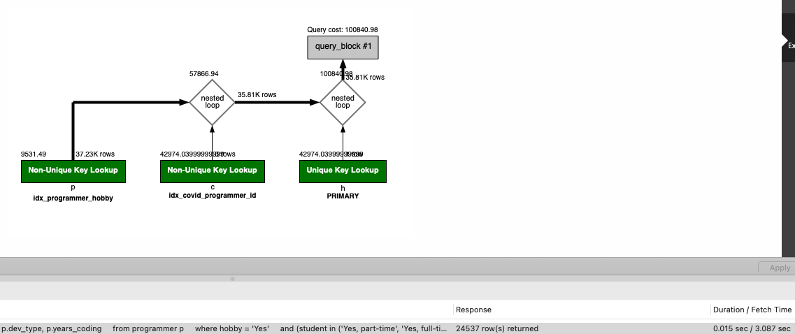

    * `order by p.id`를 추가하여 정렬하였습니다.
        * 성능(Duration / Fetch Time): **0.019 sec / 1.898 sec**
          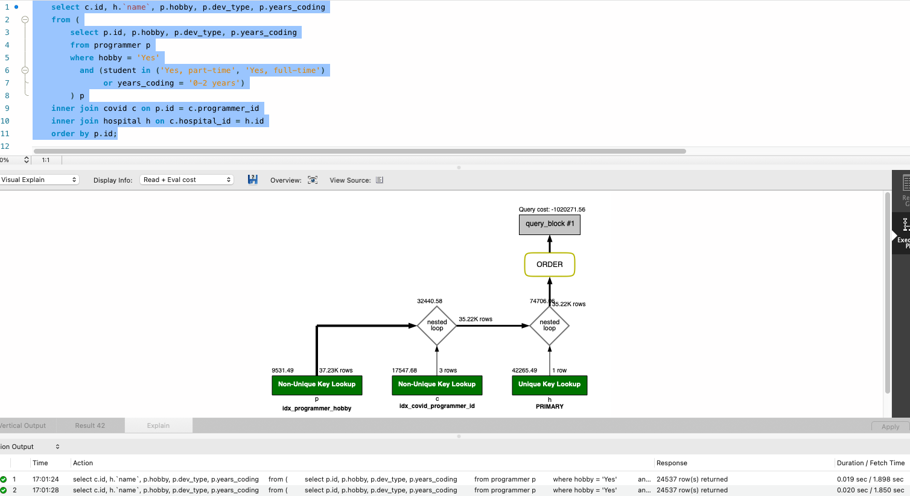

* [X] 서울대병원에 다닌 20대 India 환자들을 병원에 머문 기간별로 집계하세요. (covid.Stay)
    ```sql
    select c.stay, count(*) as `total`
    from programmer p
    inner join member m on m.id = p.member_id
    inner join covid c on c.programmer_id = p.id
    inner join hospital h on h.id = c.hospital_id
    where h.`name` = '서울대병원'
      and p.country = 'India'
      and (m.age >= 20 and m.age < 30)
    group by c.stay;
    ```  
  #### 1. 초기 상태 (Duration / Fetch Time): 22.015 sec / 0.000025 sec
  

  #### 2. `member.id` PK로 설정 (Duration / Fetch Time): 0.523 sec / 0.000010 sec
  ```sql
  ALTER TABLE `subway`.`member` 
  CHANGE COLUMN `id` `id` BIGINT(20) NOT NULL ,
  ADD PRIMARY KEY (`id`);
  ```
  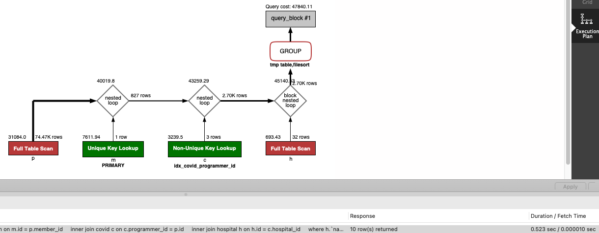

  #### 3. `programmer` 인덱스 설정 (Duration / Fetch Time): 0.068 sec / 0.0000079 sec
    * `country, member_id` 인덱스 설정
      ```sql
      ALTER TABLE `subway`.`programmer` 
      ADD INDEX `idx_country_member` (`country` ASC, `member_id` ASC);
      ```
      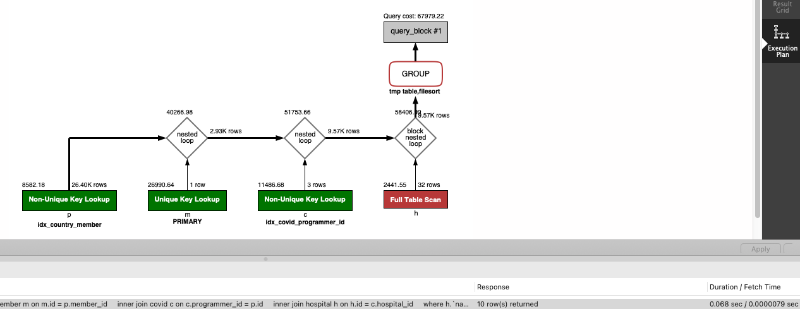

  #### 4. `covid` 인덱스 설정 (Duration / Fetch Time): 0.039 sec / 0.000010 sec
    * `programmer_id, hospital_id`
      ```sql
      ALTER TABLE `subway`.`covid` 
      ADD INDEX `idx_programmer_hospital` (`programmer_id` ASC, `hospital_id` ASC);
      ```
      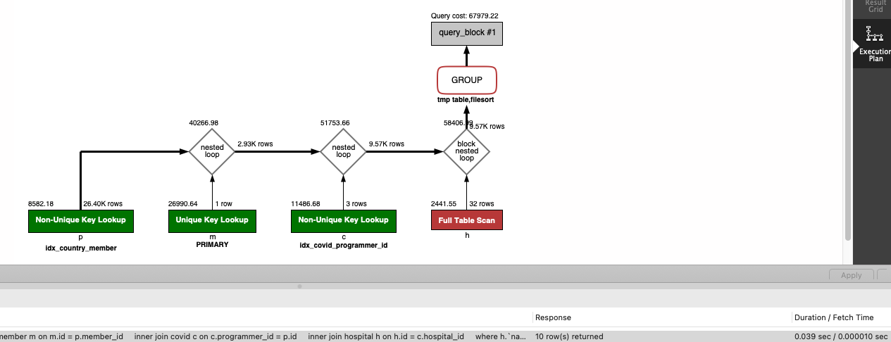

  #### 5. `hospital.name` 인덱스 설정 (Duration / Fetch Time): 0.036 sec / 0.000012 sec
  ```sql
  CREATE INDEX `idx_hospital_name`  ON `subway`.`hospital` (name) COMMENT '' ALGORITHM DEFAULT LOCK DEFAULT;
  ```
  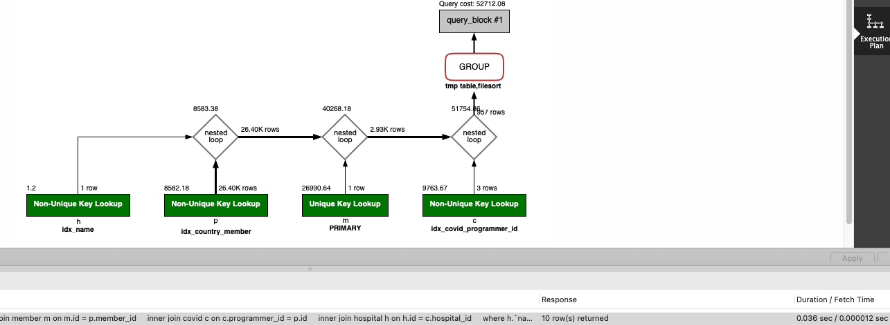

* [X] 서울대병원에 다닌 30대 환자들을 운동 횟수별로 집계하세요. (~~user.Exercise~~ programmer.exercise)
  ```sql
  select p.exercise, count(*)
  from programmer p
  inner join covid c on c.programmer_id = p.id
  inner join member m on m.id = p.member_id
  inner join hospital h on h.id = c.hospital_id
  where h.`name` = '서울대병원'
    and (m.age >= 30 and m.age < 40)
  group by p.exercise;
  ```

  #### 1. 초기 상태 (Duration / Fetch Time): 2.230 sec / 0.0000079 sec
  

  #### 2. `programmer` 인덱스 추가 (Duration / Fetch Time): 0.104 sec / 0.0000091 sec
    * `member_id, exercise`
    ```sql
    ALTER TABLE `subway`.`programmer` 
    ADD INDEX `idx_member_exercise` (`member_id` ASC, `exercise` ASC);
    ```
    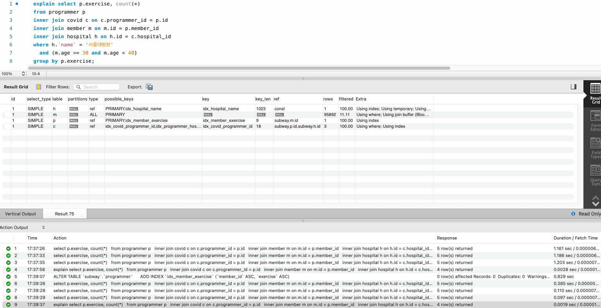

  #### 3. `member.age` 인덱스 추가 (Duration / Fetch Time): 0.061 sec / 0.0000079 sec
  ```sql
  CREATE INDEX `idx_member_age`  ON `subway`.`member` (age) COMMENT '' ALGORITHM DEFAULT LOCK DEFAULT
  ```
  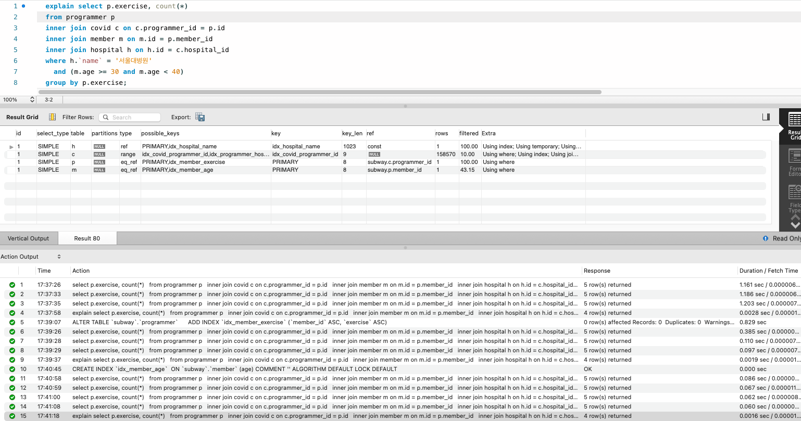

  #### 4. `covid` 인덱스 추가 (Duration / Fetch Time): 0.028 sec / 0.0000091 sec
  ```sql
  ALTER TABLE `subway`.`covid` 
  ADD INDEX `idx_hospital_member_programmer` (`hospital_id` ASC, `member_id` ASC, `programmer_id` ASC);
  ```
  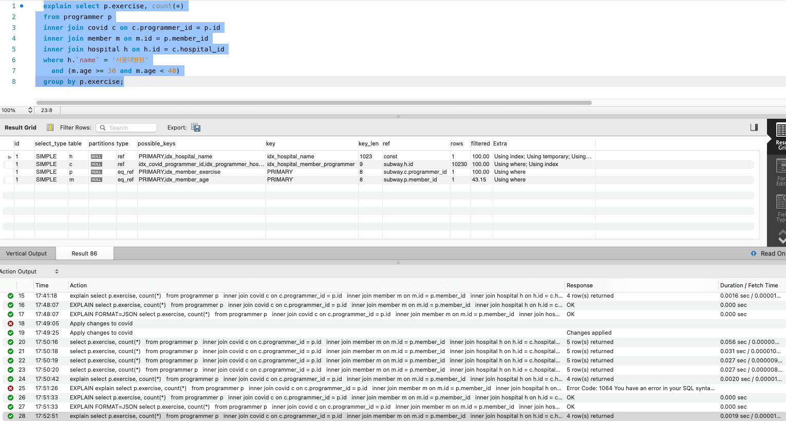

---

### 추가 미션

1. 페이징 쿼리를 적용한 API endpoint를 알려주세요
