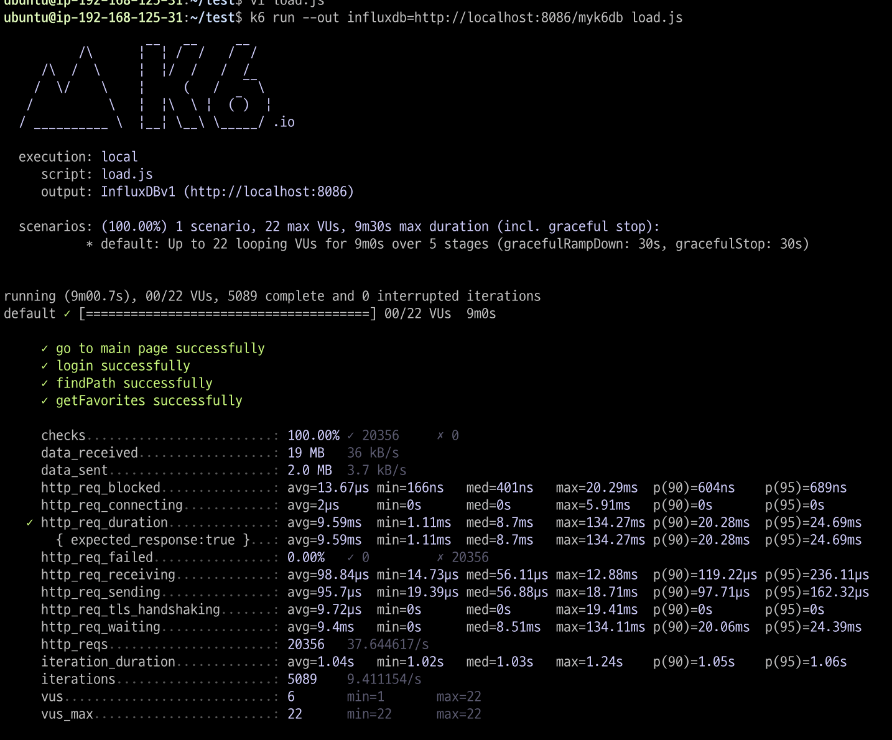
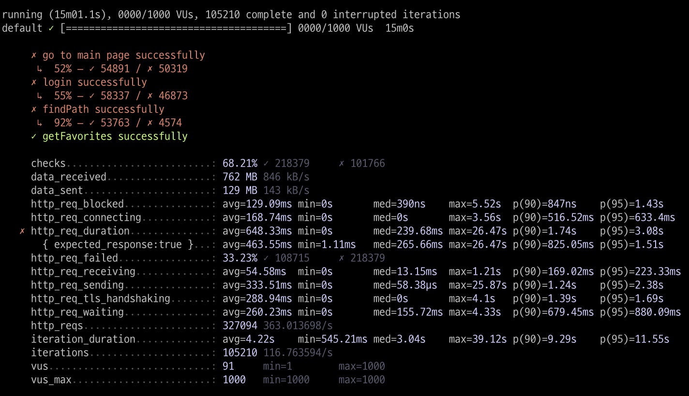
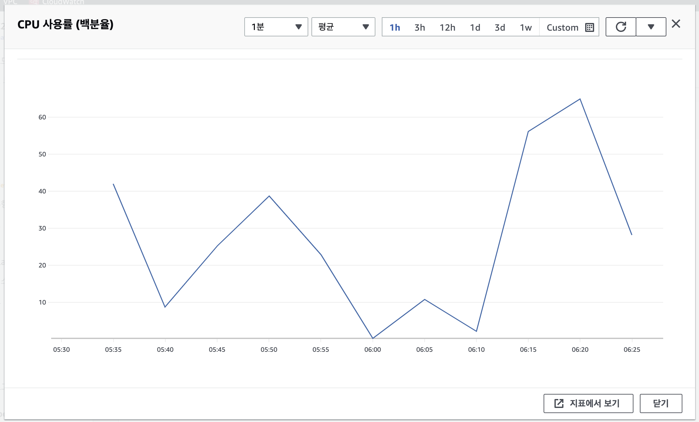
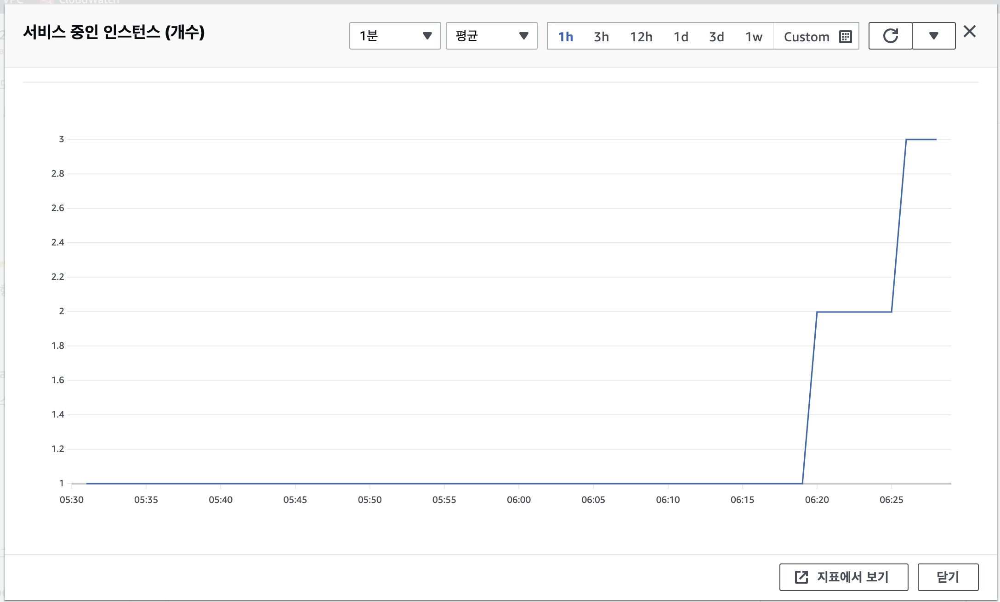
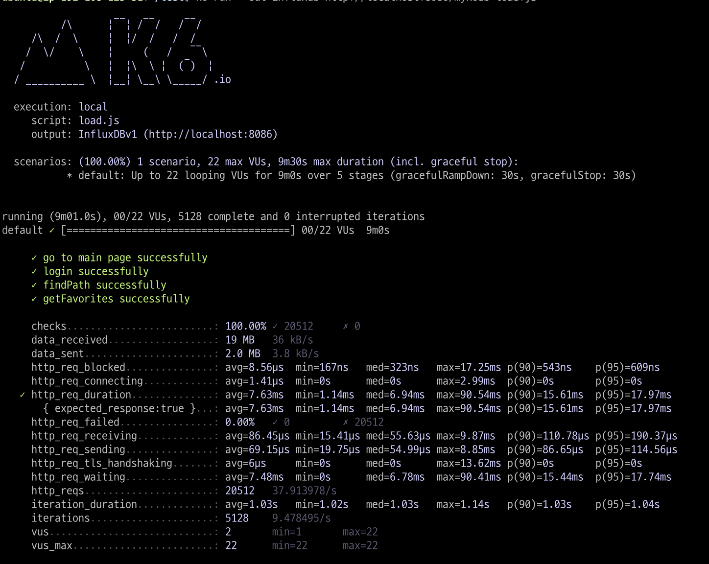
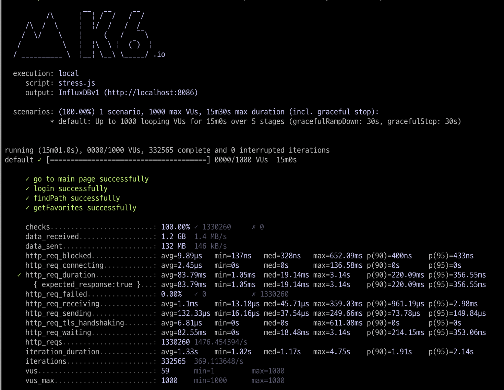

<p align="center">
    
</p>
<p align="center">
  
  
  <a href="https://edu.nextstep.camp/c/R89PYi5H" alt="nextstep atdd">
    
  </a>
  
</p>

<br>

# 인프라공방 샘플 서비스 - 지하철 노선도

<br>

## 🚀 Getting Started

### Install

#### npm 설치

```
cd frontend
npm install
```

> `frontend` 디렉토리에서 수행해야 합니다.

### Usage

#### webpack server 구동

```
npm run dev
```

#### application 구동

```
./gradlew clean build
```

<br>

## 미션

* 미션 진행 후에 아래 질문의 답을 작성하여 PR을 보내주세요.

### 1단계 - 화면 응답 개선하기

1. 성능 개선 결과를 공유해주세요 (Smoke, Load, Stress 테스트 결과)

* 
* 
* 

* 개선 전 / 후 계측 비교

| 구분         | FCP   | TTI   | SP    | TBT   | LCP  | CLS   |
|------------|-------|-------|-------|-------|------|-------|
| 서울교통공사     | 6.5s  | 9.2s  | 11.9s | 0.187s | 6.7s | 0     |
| 네이버 지도     | 2.2s  | 6.5s  | 5.4s  | 0.34s | 8.1s | 0.03  |
| 카카오맵       | 1.7s  | 4.2s  | 7.1s  | 0.05s | 6.4s | 0.005 |
| 내 사이트 개선 전 | 14.3s | 14.9s | 14.3s | 0.48s | 15s  | 0.042 |
| 내 사이트 개선 후 | 2.5s  | 5.6s  | 4.7s  | 0.62s | 5.7s | 0.041 |

2. 어떤 부분을 개선해보셨나요? 과정을 설명해주세요

* @Trancsactional(readOnly=true) 읽기전용 트랜잭션 처리
* nginx Reverse Proxy 개선
* gzip 압축,
* 캐시적용
* TLS, HTTP/2 설정

---

### 2단계 - 스케일 아웃

1. Launch Template 링크를 공유해주세요.

* [x] springboot에 HTTP Cache, gzip 설정하기
    * [x] 모든 정적 자원에 대해 no-cache, private 설정을 하고 테스트 코드를 통해 검증합니다.
    * [x] 확장자는 css인 경우는 max-age를 1년, js인 경우는 no-cache, private 설정을 합니다.
    * [x] 모든 정적 자원에 대해 no-cache, no-store 설정을 한다. 가능한가요? => 가능하다.
* [x] Launch Template 작성하기
* [x] Auto Scaling Group 생성하기
* [x] DNS 설정  
  [Launch Template 링크](https://ap-northeast-2.console.aws.amazon.com/ec2/v2/home?region=ap-northeast-2#LaunchTemplateDetails:launchTemplateId=lt-02f3ad26f57232498)


2. cpu 부하 실행 후 EC2 추가생성 결과를 공유해주세요. (Cloudwatch 캡쳐)
   
   

3. 성능 개선 결과를 공유해주세요 (Smoke, Load, Stress 테스트 결과)
   
   
   

```sh
$ stress -c 2
```

---

### 1단계 - 쿼리 최적화

1. 인덱스 설정을 추가하지 않고 아래 요구사항에 대해 1s 이하(M1의 경우 2s)로 반환하도록 쿼리를 작성하세요.

- [x] 활동중인(Active) 부서의 현재 부서관리자 중 연봉 상위 5위안에 드는 사람들이 최근에 각 지역별로 언제 퇴실했는지 조회해보세요. (사원번호, 이름, 연봉, 직급명, 지역, 입출입구분, 입출입시간)
- [x] 인덱스 설정을 추가하지 않고 1s 이하로 반환합니다. => 0.279 sec 소요

```mysql

select e.id            as '사원번호',
       e.last_name     as '이름',
       s.annual_income as '연봉',
       p.position_name as '직책명',
       r.region        as '지역명',
       r.record_symbol as '입출입구분',
       r.time          as '입출입시간'
from employee e
         inner join (
    select id, annual_income
    from salary
    where id in (
        select employee_id
        from manager
        where department_id in (
            select id
            from department
            where note = 'Active')
          and start_date <= now()
          and end_date >= now()
    )
      and start_date <= now()
      and end_date >= now()
    order by annual_income desc
    limit 5
) s on e.id = s.id
         inner join position p on e.id = p.id and p.start_date <= now() and p.end_date >= now()
         inner join record r on e.id = r.employee_id and r.record_symbol = 'O';

```

---

### 2단계 - 인덱스 설계

1. 인덱스 적용해보기 실습을 진행해본 과정을 공유해주세요

---

### 추가 미션

1. 페이징 쿼리를 적용한 API endpoint를 알려주세요
