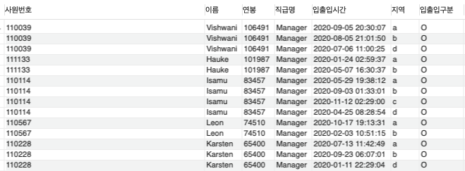

<p align="center">
    
</p>
<p align="center">
  
  
  <a href="https://edu.nextstep.camp/c/R89PYi5H" alt="nextstep atdd">
    
  </a>
  
</p>

<br>

# 인프라공방 샘플 서비스 - 지하철 노선도

<br>

## 🚀 Getting Started

### Install
#### npm 설치
```
cd frontend
npm install
```
> `frontend` 디렉토리에서 수행해야 합니다.

### Usage
#### webpack server 구동
```
npm run dev
```
#### application 구동
```
./gradlew clean build
```
<br>

## 미션

* 미션 진행 후에 아래 질문의 답을 작성하여 PR을 보내주세요.


### 1단계 - 화면 응답 개선하기
1. 성능 개선 결과를 공유해주세요 (Smoke, Load, Stress 테스트 결과)

#### 개선 전

1. Smoke Test(http://3.35.223.220/d/bvXIAmq7z/k6-smoke-testing-results?orgId=1&from=1656599880000&to=1656600599000)
2. Load Test(http://3.35.223.220/d/080n0mqnz/k6-load-testing-results?orgId=1&from=1656597900000&to=1656599100000)
3. Stress Test(http://3.35.223.220/d/TMFSAmq7k/k6-stress-test-result?orgId=1&from=1656598800000&to=1656599699000)

#### 개선 후
1. Smoke Test(http://3.35.223.220/d/bvXIAmq7z/k6-smoke-testing-results?orgId=1&from=1656668640000&to=1656669299000)
2. Load Test(http://3.35.223.220/d/080n0mqnz/k6-load-testing-results?orgId=1&from=1656669300000&to=1656670200000)
3. Stress Test(http://3.35.223.220/d/TMFSAmq7k/k6-stress-test-result?orgId=1&from=1656667140000&to=1656667920000)

#### 성능 비교 표(pageSpeed)

| https://jhsong2580.kro.kr/ | FCP(Sec) | LCP(Sec) | TTI(Sec) | TBT(mSec) |
|:--------------------------:|:--------:|:--------:|:--------:|:---------:|
|            개선전             |   14.8   |   15.3   |   15.4   |    510    |
|      1차 개선 (캐싱/Gzip설정)       |   5.4    |   6.0    |   6.1    |    560    |

| https://jhsong2580.kro.kr/stations | FCP(Sec) | LCP(Sec) | TTI(Sec) | TBT(mSec) |
|:--------------------------:|:--------:|:--------:|:--------:|:---------:|
|            개선전             |   16.7   |   16.7   |   25.7   |   8_510   |
|      1차 개선 (캐싱/Gzip설정)       |   7.1    |   7.1    |   17.1   |   9_720   |
|      2차 개선 (redis 캐싱설정)       |   6.8    |   6.8    |   13.4   |   6_330   |

| https://jhsong2580.kro.kr/lines | FCP(Sec) | LCP(Sec) | TTI(Sec) | TBT(mSec) |
|:-------------------------------:|:--------:|:--------:|:--------:|:---------:|
|               개선전               |   16.2   |   16.2   |   17.9   |   1_210   |
|        1차 개선 (캐싱/Gzip설정)        |   6.8    |   6.8    |   8.3    |   1_240   |
|       2차 개선 (redis 캐싱설정)        |   6.8    |   6.8    |   8.0    |   1_040   |

#### 성능비교 표(K6)
| testType |                      개선전                      |                      개선후                      | 
|:--------:|:---------------------------------------------:|:---------------------------------------------:|
|  smoke   |   |   |   
|   load   |    |    |   
|  stress  |  |  |   
 

2. 어떤 부분을 개선해보셨나요? 과정을 설명해주세요
   0. 점검
      1. thread.dump 점검 결과 교착 걸린 부분이나 지나치게 CPU 점유기간이 긴 쓰레드는 없음
   1. 1차 개선
      1. Gzip : 가장 높은 압축률(9)로 압축 설정
      2. Proxy Cache 설정 : css,이미지들을 한달간 캐싱한다.
   2. 2차개선 (/lines, /stations)
      1. line.findAll(), station.findAll()에 대해 캐싱한다


---

### 2단계 - 스케일 아웃

1. Launch Template 링크를 공유해주세요.

2. cpu 부하 실행 후 EC2 추가생성 결과를 공유해주세요. (Cloudwatch 캡쳐)

```sh
$ stress -c 2
```

3. 성능 개선 결과를 공유해주세요 (Smoke, Load, Stress 테스트 결과)

---

### 1단계 - 쿼리 최적화

1. 인덱스 설정을 추가하지 않고 아래 요구사항에 대해 1s 이하(M1의 경우 2s)로 반환하도록 쿼리를 작성하세요.
  - 활동중인(Active) 부서의 현재 부서관리자 중 연봉 상위 5위안에 드는 사람들이 최근에 각 지역별로 언제 퇴실했는지 조회해보세요. (사원번호, 이름, 연봉, 직급명, 지역, 입출입구분, 입출입시간)

    1. 일단 조회해보자 (평균 소요시간 : 0.45sec)
       select e.id as 사원번호, e.last_name as 이름, e.annual_income as 연봉, "Manager" as 직급명, r.time as 입출입시간, r.region as 지역, 'O' as 입출입구분 from (
           select e.*, s.annual_income from employee as e
               join (
                   select employee_id from manager
                       where end_date ="9999-01-01"
                           and employee_id in (select  id from position where position_name="manager") ##POSITION이 manager
                           and employee_id in (select employee_id from employee_department where department_id in (select id from department where note="active"))
               ) as m on m.employee_id = e.id
               join (
                   select id as salary_id, annual_income from salary where end_date ="9999-01-01"
               ) as s on s.salary_id = e.id
               order by s.annual_income desc 
               limit 0,5
        ) as e
        join (
            select employee_id, time, region  from record
                where record_symbol="O"
                    and region <> ""
        ) as r on r.employee_id = e.id
        order by 연봉 desc, 지역;

       1. 1차 조회 결과(정상, 평균 0.43sec)
          
       2. 실행계획
          
---

### 2단계 - 인덱스 설계

1. 인덱스 적용해보기 실습을 진행해본 과정을 공유해주세요

---

### 추가 미션

1. 페이징 쿼리를 적용한 API endpoint를 알려주세요


