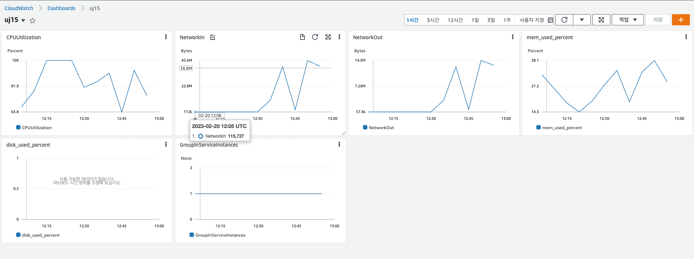
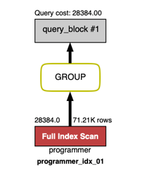

<p align="center">
    
</p>
<p align="center">
  
  
  <a href="https://edu.nextstep.camp/c/R89PYi5H" alt="nextstep atdd">
    
  </a>
  
</p>

<br>

# 인프라공방 샘플 서비스 - 지하철 노선도

<br>

## 🚀 Getting Started

### Install
#### npm 설치
```
cd frontend
npm install
```
> `frontend` 디렉토리에서 수행해야 합니다.

### Usage
#### webpack server 구동
```
npm run dev
```
#### application 구동
```
./gradlew clean build
```
<br>

## 미션

* 미션 진행 후에 아래 질문의 답을 작성하여 PR을 보내주세요.


### 1단계 - 화면 응답 개선하기
1. 성능 개선 결과를 공유해주세요 (Smoke, Load, Stress 테스트 결과)
* smoke
- Before


- After


* Load
- Before


- After


* StressF
- Before


- After


2. 어떤 부분을 개선해보셨나요? 과정을 설명해주세요
* Reverse Proxy
* gzip 압축
* cache
* TLS, HTTP/2 설정
* WAS 성능 개선
* Spring Data Cache
---

### 2단계 - 스케일 아웃

1. Launch Template 링크를 공유해주세요.
 - https://ap-northeast-2.console.aws.amazon.com/ec2/home?region=ap-northeast-2#LaunchTemplateDetails:launchTemplateId=lt-0f7f43df641776bc7
2. cpu 부하 실행 후 EC2 추가생성 결과를 공유해주세요. (Cloudwatch 캡쳐)
- cloudWatch autoscaling

- cloudWatch ec2

* smoke


* Load


* Stress


```sh
$ stress -c 2
```

3. 성능 개선 결과를 공유해주세요 (Smoke, Load, Stress 테스트 결과)

---

### 3단계 - 쿼리 최적화

1. 인덱스 설정을 추가하지 않고 아래 요구사항에 대해 1s 이하(M1의 경우 2s)로 반환하도록 쿼리를 작성하세요.
- 활동중인(Active) 부서의 현재 부서관리자 중 연봉 상위 5위안에 드는 사람들이 최근에 각 지역별로 언제 퇴실했는지 조회해보세요. (사원번호, 이름, 연봉, 직급명, 지역, 입출입구분, 입출입시간)
```sql
  select  v1.employee_id 사원번호
         ,v1.last_name 이름
         ,v1.annual_income 연봉
         ,r.time 입출입시간
         ,r.region 지역
         ,r.record_symbol 입출입구분
    from (
         select m.employee_id,
                e.last_name,
                s.annual_income,
                p.position_name
         from manager m
                  join department d on d.id = m.department_id
                  join position p   on p.id = m.employee_id
                  join employee e   on e.id = m.employee_id
                  join salary s     on s.id = e.id
         where d.note = 'active'
           and now() between m.start_date and m.end_date
           and now() between s.start_date and s.end_date
           and p.position_name = 'manager'
         order by s.annual_income desc
         limit 5
         ) v1
     join record r on r.employee_id = v1.employee_id
    where record_symbol = 'O'
    order by 연봉 desc
```
- query plan

- query result

---

### 4단계 - 인덱스 설계
### 요구사항
- Coding as a Hobby 와 같은 결과를 반환하세요.
- 프로그래머별로 해당하는 병원 이름을 반환하세요. (covid.id, hospital.name)
- 프로그래밍이 취미인 학생 혹은 주니어(0-2년)들이 다닌 병원 이름을 반환하고 user.id 기준으로 정렬하세요. (covid.id, hospital.name, user.Hobby, user.DevType, user.YearsCoding)
- 서울대병원에 다닌 20대 India 환자들을 병원에 머문 기간별로 집계하세요. (covid.Stay)
- 서울대병원에 다닌 30대 환자들을 운동 횟수별로 집계하세요. (user.Exercise)

1. 인덱스 적용해보기 실습을 진행해본 과정을 공유해주세요

1) Coding as a Hobby 와 같은 결과를 반환하세요.
```sql
  SELECT hobby
        ,ROUND((COUNT(id) / (SELECT COUNT(id) FROM programmer) * 100), 1) AS rate
    FROM programmer
GROUP BY hobby
```
### 개선 전 조회시간 & Plan
- 982ms <br/>

### 개선 후 조회시간 & Plan
- 100ms <br/>

### 적용 방법
- 적용 INDEX : CREATE INDEX programmer_idx_01 ON programmer ( hobby, id );
- 적용 이유
  * 첫번째는, 쿼리절에 사용하는 컬럼절을 인덱스 요소에 포함시켜서 테이블 풀스캔을 하지 않아서 I/O시간을 줄이는것이였습니다.
  * 두번째는, Group By별로 Id를 Count하는것이기 때문에, 인덱스 선행 컬럼을 hobby로 두어 최적화를 노렸습니다.

2) 프로그래머별로 해당하는 병원 이름을 반환하세요. (covid.id, hospital.name)
```sql
     SELECT c.id, h.name
       FROM covid c
 INNER JOIN hospital h ON c.hospital_id = h.id;
```
### 개선 전 조회시간 & Plan
- 23ms <br/>


### 개선 후 조회시간 & Plan
- 같음
### 적용 방법
- 적용 하지 않은 이유
    * 첫번째는, 특별한 equal조건이 존재하지 않기 때문에 인덱스로써 변별력을 가지기 어려웠기 때문입니다.
    * 두번째는, 인덱스는 소량의 데이터에 최적화되어 있습니다. 그 이뉴는 I/O단위를 싱글 블럭을 기준으로 실행하기 때문으로 알고 있습니다.
    * 위와 같은 사례는, 데이터가 늘어나면 날수록 인덱스를 타게 될시에 손해가 나는 구조입니다. 그렇기 때문에 적용하지 않는 편이 장기적으로 더 좋을수 있다고 생각했습니다.
    * 마지막으로 세번째는, 인덱스 역시 기존 테이블과 동기화를 해야 하므로 부과적인 손해를 발생시킵니다. 그런 손해 또한 방지하고 싶었습니다.
3) 프로그래밍이 취미인 학생 혹은 주니어(0-2년)들이 다닌 병원 이름을 반환하고 user.id 기준으로 정렬하세요. (covid.id, hospital.name, user.Hobby, user.DevType, user.YearsCoding)
```sql
     SELECT c.id, c.programmer_id, h.name, p.hobby, p.dev_type, p.years_coding
       FROM programmer p
 INNER JOIN covid c ON p.id = c.programmer_id
 INNER JOIN hospital h ON h.id = c.hospital_id
      WHERE p.hobby = 'Yes'
        AND (p.years_coding = '0-2 years' OR p.student LIKE 'Y%');
```
### 개선 전 조회시간 & Plan
- Read Connection TimeOut을 100초를 걸었는데, 초과하였으므로 100초 이상이라 예상합니다.
- 그 이상 시간을 재는건 의미 없다 판단하였습니다.

### 개선 후 조회시간 & Plan
- 24ms <br/>


### 적용 방법
- 적용 INDEX 
  * CREATE INDEX programmer_idx_01 ON programmer ( hobby, id );
  * CREATE INDEX hospital_idx_01 ON hospital ( id );
- 적용 이유
    * 첫번째는, 변별력을 가진 컬럼을 인덱스로 선정하고 싶었고 그 때문에 programmer_idx_01의 hobby를 선행컬럼으로 선정했습니다.
    * 두번째는, hospital 역시 id가 join column으로 활용되고 있었고, NL조인은 각각 테이블이 Index를 가지고 있을때 그 효과가 극대화되기에 id로 인덱스를 만들었습니다.
    * 세번째는, covid는 데이터가 31만 정도로 Index를 통한 데이터 접근보다 Multi Block을 통한 데이터 접근이 좀더 시간이 단축되기에 따로 인덱스를 생성하지 않았습니다.
4) 서울대병원에 다닌 20대 India 환자들을 병원에 머문 기간별로 집계하세요. (covid.Stay)
```sql
     SELECT c.stay, COUNT(c.stay)
       FROM covid c
 INNER JOIN hospital h ON c.hospital_id = h.id AND h.name = '서울대병원'
 INNER JOIN member m ON c.member_id = m.id AND m.age IN ('20', '21', '22', '23', '24', '25', '26', '27', '28', '29')
 INNER JOIN programmer p ON c.id = p.id AND p.country = 'India'
   GROUP BY c.stay;
```
### 개선 전 조회시간 & Plan
- 20초 <br/>

### 개선 후 조회시간 & Plan
- 82ms <br/>


### 적용 방법
- 적용 INDEX
  * CREATE UNIQUE INDEX hospital_idx_03 ON hospital (name);
  * CREATE UNIQUE INDEX programmer_idx_03 ON programmer (id);
  * CREATE INDEX covid_idx_04 ON covid (hospital_id);
  * CREATE INDEX member_idx_03 ON member (  id, age );
- 적용 이유
    * 첫번째는, hospital의 name에 unique값을 주어서 const로 만들었습니다.
    * 두번째는, 쿼리에서 age에 In절과 between값을 고민하였는데, IN절에 값을 명시하였을때 filtering되는 값이 많아서 In절을 적용하였습니다. 
    * 그외에는 위에서 설명드린것과 같은 기준으로 인덱스를 선정하였습니다.
5) 서울대병원에 다닌 30대 환자들을 운동 횟수별로 집계하세요. (user.Exercise)
```sql
     SELECT exercise, COUNT(exercise)
       FROM covid c
 INNER JOIN hospital h ON c.hospital_id = h.id AND h.name = '서울대병원'
 INNER JOIN member m ON c.member_id = m.id AND m.age BETWEEN 30 AND 39
 INNER JOIN programmer p ON p.id = c.id
   GROUP BY p.exercise;
```
### 개선 전 조회시간 & Plan
- 12초

### 개선 후 조회시간 & Plan
- 76ms

### 적용 방법
- 적용 INDEX
    * CREATE UNIQUE INDEX hospital_idx_03 ON hospital (name);
    * CREATE UNIQUE INDEX programmer_idx_03 ON programmer (id);
    * CREATE INDEX covid_idx_04 ON covid (hospital_id);
    * CREATE INDEX member_idx_03 ON member (  id, age );
- 적용 이유
    * 위와 같고 다른점은 이번에는 between을 사용하였습니다.
    * between은 <과 같은 부등호로 작동하고, In절은 값을 비교하는 filtering방식으로 진행되는데 이번에는 between을 사용하는 편이 filter되는 데이터가 많기에 다음과 같이 사용하였습니다.

---

### 추가 미션

1. 페이징 쿼리를 적용한 API endpoint를 알려주세요
