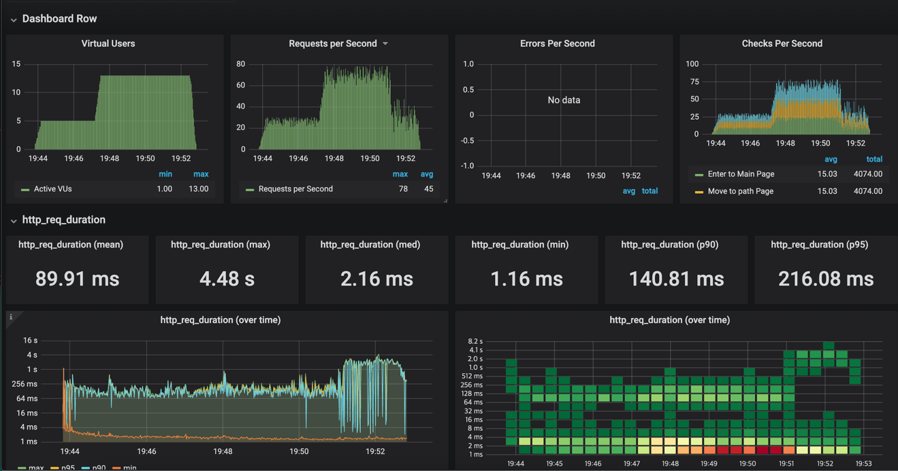
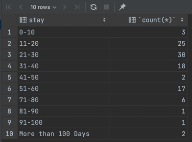
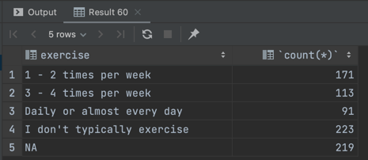

<p align="center">
    
</p>
<p align="center">
  
  
  <a href="https://edu.nextstep.camp/c/R89PYi5H" alt="nextstep atdd">
    
  </a>
  
</p>

<br>

# 인프라공방 샘플 서비스 - 지하철 노선도

<br>

## 🚀 Getting Started

### Install
#### npm 설치
```
cd frontend
npm install
```
> `frontend` 디렉토리에서 수행해야 합니다.

### Usage
#### webpack server 구동
```
npm run dev
```
#### application 구동
```
./gradlew clean build
```
<br>

## 미션

* 미션 진행 후에 아래 질문의 답을 작성하여 PR을 보내주세요.


### 1단계 - 화면 응답 개선하기
1. 성능 개선 결과를 공유해주세요 (Smoke, Load, Stress 테스트 결과)
- load : 2.64ms -> 2.84ms
- smoke : 4.96ms -> 7.82ms
- stress : 1.04s -> 304ms
- 다른 부분은 차이가 없거나 더 늘어났으나 stress는 크게 개선됐습니다.

2. 어떤 부분을 개선해보셨나요? 과정을 설명해주세요
- 1차 튜닝 :  gzip 압축, cache, HTTP2 적용
- 2차 튜닝 : Spring Data Cache를 적용했습니다.
---

### 2단계 - 스케일 아웃

1. Launch Template 링크를 공유해주세요.
- snh15978-template
- https://ap-northeast-2.console.aws.amazon.com/ec2/home?region=ap-northeast-2#LaunchTemplateDetails:launchTemplateId=lt-099e53bb11892771a
2. cpu 부하 실행 후 EC2 추가생성 결과를 공유해주세요. (Cloudwatch 캡쳐)
- step2 디렉토리에 추가했습니다.
```sh
$ stress -c 2
```

3. 성능 개선 결과를 공유해주세요 (Smoke, Load, Stress 테스트 결과)
- step2 디렉토리에 추가했습니다.
- load
  - before : 998.1us, after : 1.19ms
- smoke
  - before : 1.35ms, after : 5.4ms
- stress
  - vus 300 -> 600까지 확인
---

### 3단계 - 쿼리 최적화

1. 인덱스 설정을 추가하지 않고 아래 요구사항에 대해 1s 이하(M1의 경우 2s)로 반환하도록 쿼리를 작성하세요.

- 활동중인(Active) 부서의 현재 부서관리자 중 연봉 상위 5위안에 드는 사람들이 최근에 각 지역별로 언제 퇴실했는지 조회해보세요. (사원번호, 이름, 연봉, 직급명, 지역, 입출입구분, 입출입시간)
```mysql
SELECT a.id            as '사원번호',
       a.last_name     as '이름',
       a.annual_income as '연봉',
       a.position_name as '직급명',
       r.time          AS '입출입시간',
       r.region        AS '지역',
       r.record_symbol AS '입출입구분'
FROM (SELECT e.id, e.last_name, s.annual_income, p.position_name
      FROM manager m
               INNER JOIN department d ON m.department_id = d.id
               INNER JOIN employee e ON m.employee_id = e.id
               INNER JOIN salary s on e.id = s.id
               INNER JOIN position p on m.employee_id = p.id
      WHERE d.note = 'active'
        AND p.position_name = 'manager'
        AND NOW() BETWEEN m.start_date AND m.end_date
        AND NOW() BETWEEN s.start_date AND s.end_date
      ORDER BY s.annual_income DESC
      LIMIT 5) a
         INNER JOIN record r ON r.employee_id = a.id
WHERE r.record_symbol = 'O';
```
- 쿼리 실행 시간(m1)


---

### 4단계 - 인덱스 설계

1. 인덱스 적용해보기 실습을 진행해본 과정을 공유해주세요
- __Coding as a Hobby 와 같은 결과를 반환하세요.__
  - 
  - 인덱스 추가 후 실행
    - 
  - SQL
  ```sql 
  SELECT hobby,
  count(*) / (SELECT count(*) FROM programmer p) * 100 AS rate
  FROM programmer
  GROUP BY hobby;
   ```

  - 추가된 인덱스
  ```sql 
  ALTER TABLE programmer ADD INDEX idx_id(id);
  ALTER TABLE programmer ADD INDEX idx_hobby(hobby);
  ``` 
  
- __프로그래머별로 해당하는 병원 이름을 반환하세요. (covid.id, hospital.name)__
  - 
  - 인덱스 추가 후 실행
    - 
  - SQL
  ```sql 
  SELECT c.id, h.name
  FROM hospital h
  INNER JOIN covid c on h.id = c.hospital_id
  INNER JOIN programmer p on c.programmer_id = p.id;
   ```

  - 추가된 인덱스
  ```sql 
  ALTER TABLE covid ADD INDEX idx_id(id);
  ALTER TABLE covid ADD INDEX idx_programmer_id(programmer_id);
  ALTER TABLE covid ADD INDEX idx_hospital_id(hospital_id);
  ALTER TABLE hospital ADD INDEX idx_id(id);
  ``` 
  
- __프로그래밍이 취미인 학생 혹은 주니어(0-2년)들이 다닌 병원 이름을 반환하고 user.id 기준으로 정렬하세요. (covid.id, hospital.name, user.Hobby, user.DevType, user.YearsCoding)__
  - 
  - 인덱스 추가 후 실행
    - 
  - SQL
  ```sql 
  SELECT c.id,
       h.name,
       p.hobby,
       p.dev_type,
       p.years_coding
  FROM covid c
    INNER JOIN hospital h on c.hospital_id = h.id
    INNER JOIN (SELECT p.id as 'programmer_id',
                       p.hobby,
                       p.dev_type,
                       p.years_coding
                FROM programmer p
                WHERE (p.hobby = 'Yes' AND p.student LIKE 'Yes%')
                    OR p.years_coding = '0-2 years'
                ORDER BY p.id) p ON p.programmer_id = c.programmer_id;
   ```

  - 추가된 인덱스
  ```sql 
  ALTER TABLE programmer ADD INDEX idx_years_coding(years_coding);
  ```

- __서울대병원에 다닌 20대 India 환자들을 병원에 머문 기간별로 집계하세요. (covid.Stay)__
  - 
  - 인덱스 추가 후 실행
    - 
  - SQL
  ```sql 
  SELECT c.stay, count(*)
  FROM covid c
    INNER JOIN hospital h on c.hospital_id = h.id
    INNER JOIN member m on c.member_id = m.id
    INNER JOIN programmer p on c.programmer_id = p.id
  WHERE
    h.name='서울대병원'
    AND p.country='India'
    AND m.age between 20 and 29
  GROUP BY c.stay;
   ```

  - 추가된 인덱스
  ```sql 
  ALTER TABLE member ADD INDEX idx_id(id);
  ALTER TABLE member ADD INDEX idx_age(age);
  ALTER TABLE programmer ADD INDEX idx_country(country);
  ```
  
- __서울대병원에 다닌 30대 환자들을 운동 횟수별로 집계하세요. (user.Exercise)__
  - 
  - 인덱스 추가 후 실행
    - 
  - SQL
  ```sql 
  SELECT p.exercise, count(*)
  FROM programmer p
    INNER JOIN covid c on p.id = c.programmer_id
    INNER JOIN hospital h on c.hospital_id = h.id
    INNER JOIN member m on p.member_id = m.id
  WHERE
    h.name='서울대병원'
    AND m.age between 30 and 39
  GROUP BY p.exercise;
   ```

  - 추가된 인덱스
  ```sql 
  ALTER TABLE programmer ADD INDEX idx_exercise(exercise);
  ```
---

### 추가 미션

1. 페이징 쿼리를 적용한 API endpoint를 알려주세요
