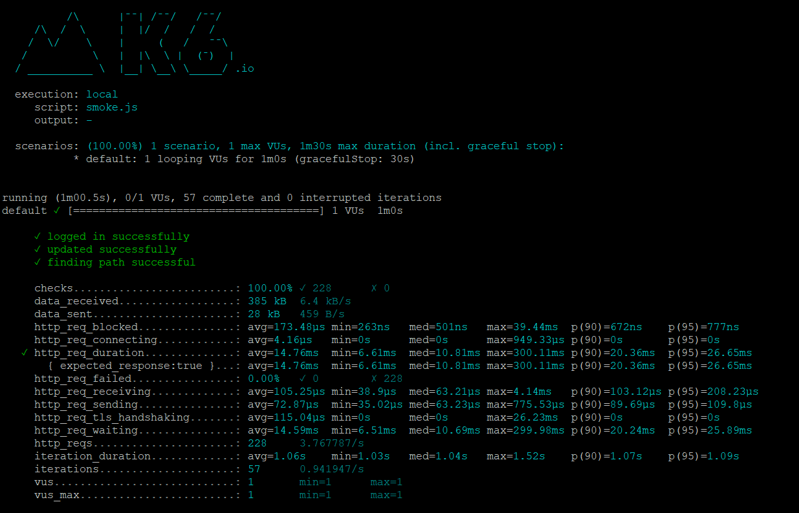
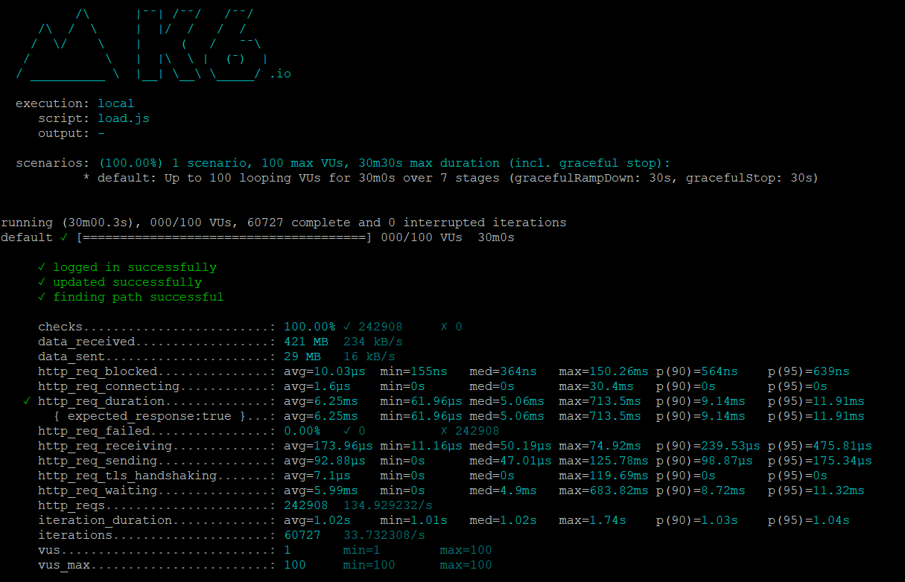
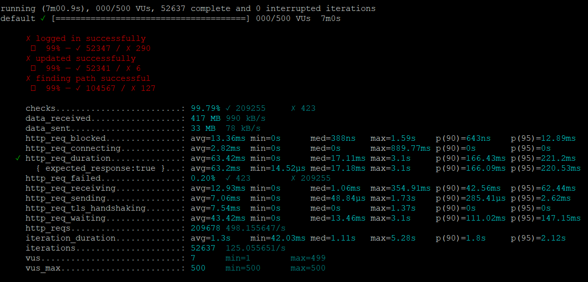
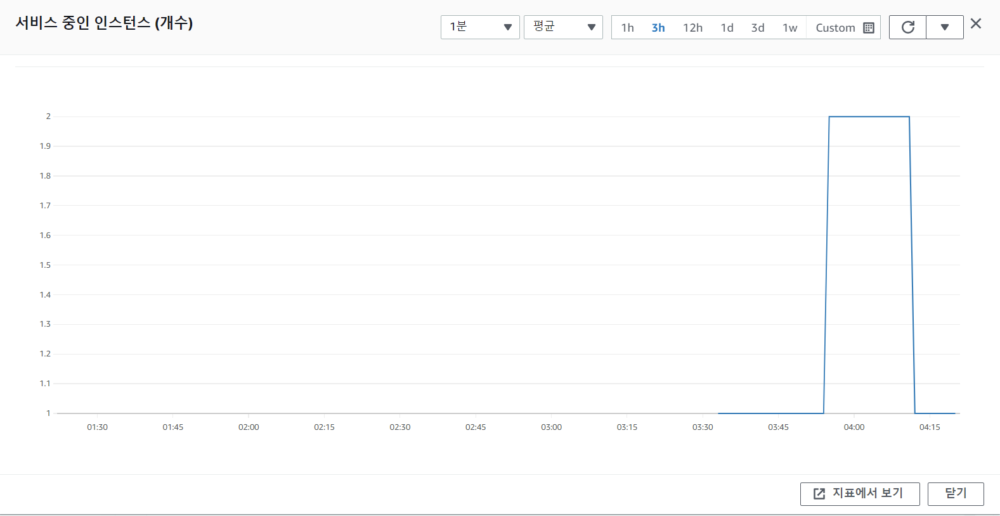
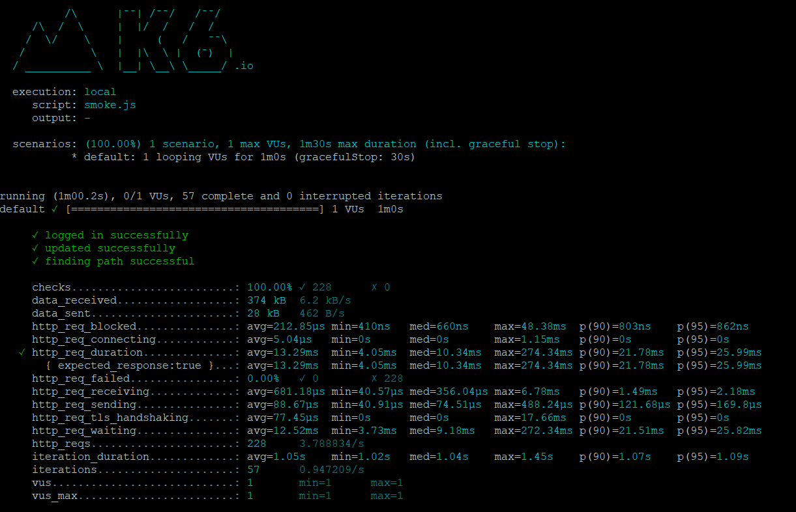
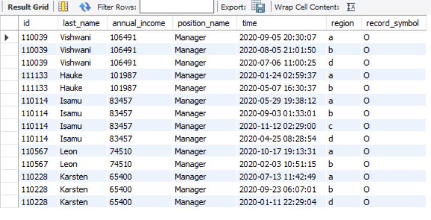
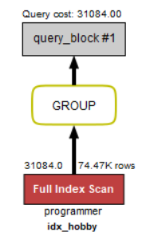

<p align="center">
    
</p>
<p align="center">
  
  
  <a href="https://edu.nextstep.camp/c/R89PYi5H" alt="nextstep atdd">
    
  </a>
  
</p>

<br>

# 인프라공방 샘플 서비스 - 지하철 노선도

<br>

## 🚀 Getting Started

### Install
#### npm 설치
```
cd frontend
npm install
```
> `frontend` 디렉토리에서 수행해야 합니다.

### Usage
#### webpack server 구동
```
npm run dev
```
#### application 구동
```
./gradlew clean build
```
<br>

## 미션

* 미션 진행 후에 아래 질문의 답을 작성하여 PR을 보내주세요.


### 1단계 - 화면 응답 개선하기
1. 성능 개선 결과를 공유해주세요 (Smoke, Load, Stress 테스트 결과)
- Smoke Test
    - 적용 전

    - 적용 후

- Load Test
    - 적용 전

    - 적용 후

- Stress Test
    - 적용 전

    - 적용 후
    
2. 어떤 부분을 개선해보셨나요? 과정을 설명해주세요
- Reverse Proxy 개선
    - gzip 압축
    - cache 설정
    - TLS, HTTP/2 설정
- Was 개선
    - Redis Server, Spring Data Cache 적용
---

### 2단계 - 스케일 아웃
1. Launch Template 링크를 공유해주세요.  
https://ap-northeast-2.console.aws.amazon.com/ec2/v2/home?region=ap-northeast-2#LaunchTemplateDetails:launchTemplateId=lt-0ad25643698f5a02d

2. cpu 부하 실행 후 EC2 추가생성 결과를 공유해주세요. (Cloudwatch 캡쳐)


3. 성능 개선 결과를 공유해주세요 (Smoke, Load, Stress 테스트 결과)
- Smoke Test

- Stress Test

---

### 1단계 - 쿼리 최적화

1. 인덱스 설정을 추가하지 않고 아래 요구사항에 대해 1s 이하(M1의 경우 2s)로 반환하도록 쿼리를 작성하세요.

- 활동중인(Active) 부서의 현재 부서관리자 중 연봉 상위 5위안에 드는 사람들이 최근에 각 지역별로 언제 퇴실했는지 조회해보세요. (사원번호, 이름, 연봉, 직급명, 지역, 입출입구분, 입출입시간)

```mysql
select 
	e.id                as '사원번호',
	e.last_name         as '이름',
	top5.annual_income  as '연봉',
	p.position_name     as '직책명',
	r.time              as '입출입시간',
	r.region            as '지역',
	r.record_symbol     as '입출입구분'
from employee e
inner join (
	select s.id, s.annual_income
	from salary s
	where id in (select employee_id from manager
		where department_id in (select id from department where note = 'Active')
		and start_date <= now() 
		and end_date >= now()
	)
	and s.start_date <= now() 
	and s.end_date >= now()
	order by s.annual_income desc
	limit 5
) top5 on top5.id = e.id
inner join record r on r.employee_id = e.id and record_symbol = 'O'
inner join position p on p.id = e.id and p.start_date <= now() and p.end_date >= now();
```
- 실행결과

---

### 2단계 - 인덱스 설계

1. 인덱스 적용해보기 실습을 진행해본 과정을 공유해주세요
#### 문제1. Coding as a Hobby 와 같은 결과를 반환하세요.
- 실행쿼리
```mysql
select hobby, 
round((count(hobby) * 100 / (select count(hobby) from programmer)), 1) as rate
from programmer 
group by hobby;
```
- 실행시간 : 0.469s -> 0.047s 
    - Programmer PK 추가
    - Programmer hobby 컬럼 index 추가
- 실행계획  


#### 문제2. 프로그래머별로 해당하는 병원 이름을 반환하세요. (covid.id, hospital.name)
- 실행쿼리
```mysql
select c.id, h.name
from covid c, hospital h, programmer p
where c.hospital_id = h.id
and c.programmer_id = p.id;
```
- 실행시간 : 0.391s -> 0.000s
    - PK 생성(Covid.id)
    - PK 생성(Hospital.id)
    - PK 생성(Programmer.id)
- 실행계획


#### 문제3. 프로그래밍이 취미인 학생 혹은 주니어(0-2년)들이 다닌 병원 이름을 반환하고 user.id 기준으로 정렬하세요. (covid.id, hospital.name, user.Hobby, user.DevType, user.YearsCoding)
- 실행쿼리
```mysql
select c.id, h.name, user.hobby, user.dev_type, user.years_coding
from covid c,
	hospital h,
(select p.id, p.hobby, p.dev_type, p.years_coding from programmer p
where (p.hobby = 'Yes' and p.student like 'Yes%')
or p.years_coding = '0-2 years') user
where c.hospital_id = h.id
and c.programmer_id = user.id; 
```
- 실행시간 : 30.016s
    - PK 생성(Covid.id)
    - PK 생성(Hospital.id)
    - PK 생성(Programmer.id)
    - 인덱스 생성(idx_covid_hospital_id)
---

### 추가 미션

1. 페이징 쿼리를 적용한 API endpoint를 알려주세요
