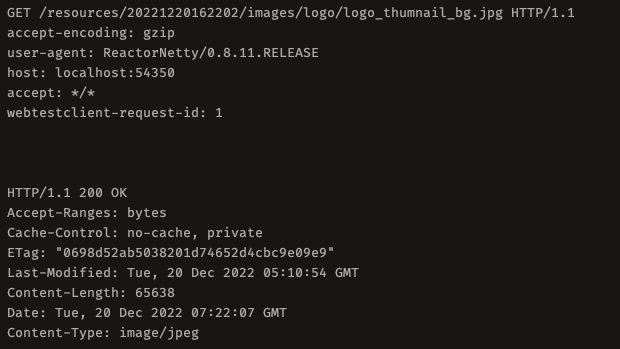
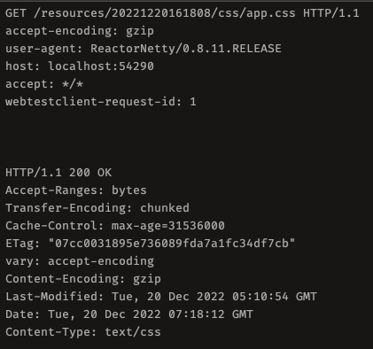
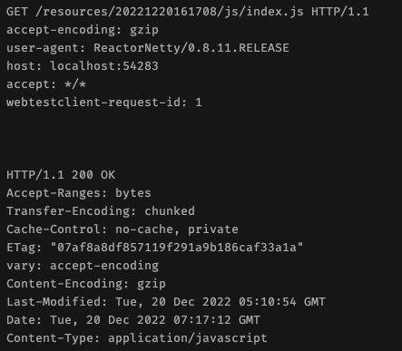
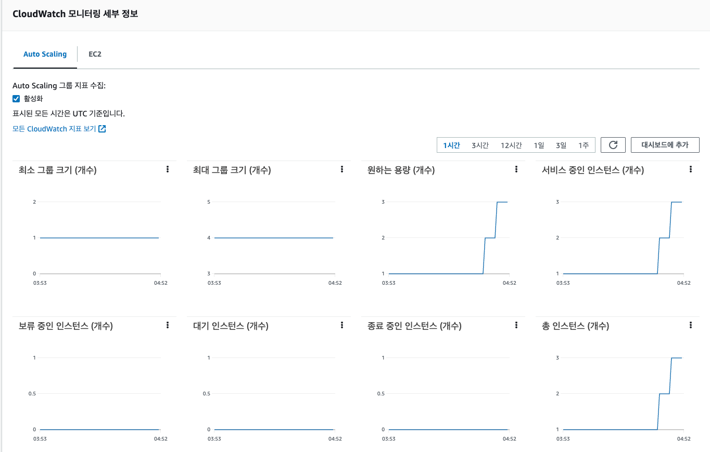
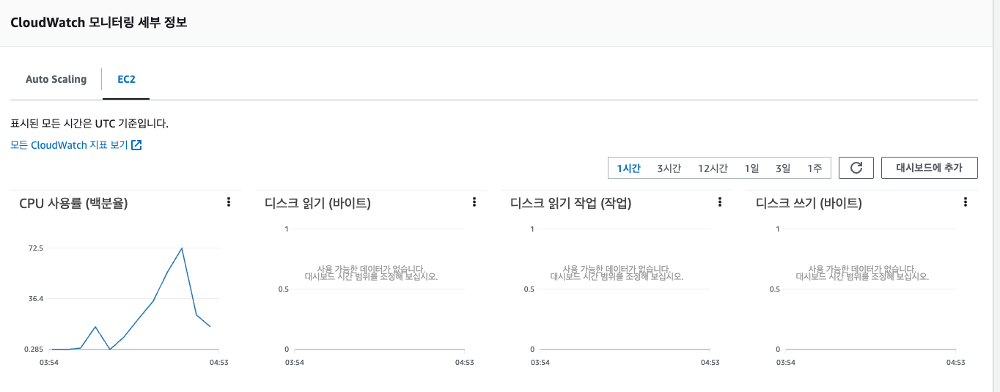
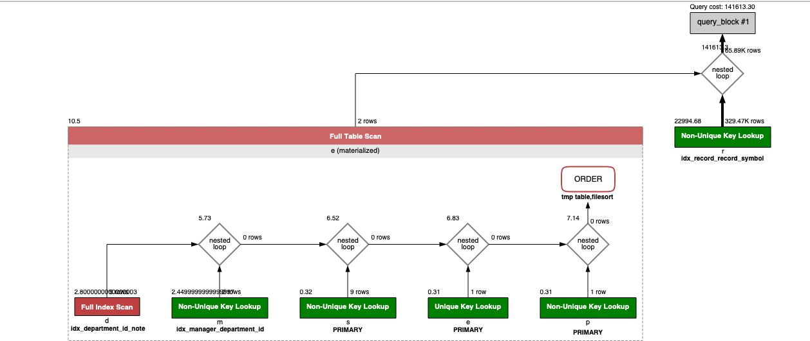
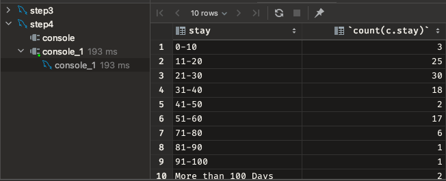

<p align="center">
    
</p>
<p align="center">
  
  
  <a href="https://edu.nextstep.camp/c/R89PYi5H" alt="nextstep atdd">
    
  </a>
  
</p>

<br>

# 인프라공방 샘플 서비스 - 지하철 노선도

<br>

## 🚀 Getting Started

### Install

#### npm 설치

```
cd frontend
npm install
```

> `frontend` 디렉토리에서 수행해야 합니다.

### Usage

#### webpack server 구동

```
npm run dev
```

#### application 구동

```
./gradlew clean build
```

<br>

## 미션

* 미션 진행 후에 아래 질문의 답을 작성하여 PR을 보내주세요.

# 1단계 - 화면 응답 개선하기

<details>


<summary> 1단계 미션 </summary>

## 성능 개선 결과를 공유해주세요 (Smoke, Load, Stress 테스트 결과)

Akamai 조사 결과에 따르면 웹 페이지 로딩 시

`1s 지연 시` `18.4%의 고객 이탈률`을 보이고,

`2s 지연 시` `62.1%의 고객 이탈률`을 보인다고 합니다

따라서 이번 성능 개선은 `1s 이내의 지연시간을 목표`로 진행하였습니다

성능 테스트 전제 조건은 다음과 같습니다.

| 부하 테스트 종류          | VU (명) | 부하 유지기간 (s) | ramp-up 기간 (s) | ramp-down 기간(s) | threshold (ms) |
|:-------------------|:------:|:-----------:|:--------------:|:---------------:|:--------------:|
| smoke              |   2    |     30      |       5        |        5        |      1000      |
| load               |  185   |     60      |       5        |        5        |      1000      |
| stress             |  275   |     60      |       5        |        5        |      1000      |

응답 시간에 대한 `기존 서비스 테스트 결과`는 다음과 같습니다.

| 부하 테스트 종류                | 응답 시간 (s) | WEB - cpu 사용률 (%) | WAS - cpu 사용률 (%) | 에러 발생 시작 VU 수 (명) |
|:-------------------------|:---------:|:-----------------:|:-----------------:|:-----------------:|
| 메인 페이지 - smoke           |   0.05    |        50         |        10         |       none        |
| 메인 페이지 - load            |    0.3    |        80         |        16         |       none        |
| 메인 페이지 - stress          |    0.4    |        90         |        16         |        275        |
| 경로 조회 페이지 - smoke        |    0.1    |        0.4        |        60         |       none        |
| 경로 조회 페이지 - load         |     8     |        10         |        70         |       none        |
| 경로 조회 페이지 - stress (250) |    12     |        30         |        70         |        250        |
| 경로 조회 페이지 - stress (max) |    40     |        100        |        70         |        250        |

테스트의 결과 채택한 개선 사항은 다음과 같습니다

* WEB - TLS, HTTP/2 적용
* WAS - Thread poll size 조정 (default 0 -> 3) + Redis Cache 사용

개선 사항을 적용한 후 테스트 결과입니다

| 부하 테스트 종류                | 응답 시간 (s) | WEB - cpu 사용률 (%)  | WAS - cpu 사용률 (%) | 에러 발생 시작 VU 수 (명) |
|:-------------------------|:---------:|:------------------:|:-----------------:|:-----------------:|
| 메인 페이지 - smoke           |   0.003   |         50         |        10         |       none        |
| 메인 페이지 - load            |   0.018   |        100         |        10         |       none        |
| 메인 페이지 - stress          |   0.25    |        100         |        30         |  275 (매우 낮은 빈도)   |
| 경로 조회 페이지 - smoke        |   0.004   |         35         |      40 ~ 25      |       none        |
| 경로 조회 페이지 - load         |    0.1    |        100         |      95 ~ 25      |       none        |
| 경로 조회 페이지 - stress (250) |   0.15    |        100         |      95 ~ 25      |        275        |
| 경로 조회 페이지 - stress (max) |    0.2    |        100         |      95 ~ 25      |   275 (6% 실패율)    |

### 결론

* 목표했던 1s의 응답값을 훨씬 밑도는 결과물을 얻었습니다
* `메인 페이지` `stress` 테스트 응답시간이 30% 이상 개선되었습니다
* `WAS` 자원을 많이 사용하는 `경로 조회 페이지 테스트` 의 경우 기존 테스트 대비 정량적으로 측정하기도 어려울 정도의 개선 효과를 얻었습니다
    * `WEB` `WAS` 둘 다 시스템 자원을 최대치로 활용이 가능해졌고, 에러가 발생하기 시작하는 빈도 또한 10% 정도의 개선이 있었습니다
* Redis Cache 적용의 효과가 컸는데, 이는 실제 운영환경에선 또 다른 결과를 얻을 수 있다고 생각합니다.
    * 하지만 지금 얻어낸 결과물에서 크게 벗어나는 (약 3배 정도 추정) 응답 시간을 받는다고 해도 목표했던 1s에는 미치지 못해 이번 개선은 성공했다고 표현하고 싶습니다
* 또한 현재 WEB의 cpu 사용률이 최대치이고, 발생 되는 에러가 주로 TCP 에러임을 감안한다면, stress 테스트 이상의 트래픽이 들어온다면 WEB 쪽 Scale out을 검토해 볼 수 있을 것 같습니다.

## 어떤 부분을 개선해보셨나요? 과정을 설명해주세요

성능 개선 이전에 성능 개선이 이루어질 수 있는 포인트를 두가지로 분리하였습니다

1. WEB
2. WAS

먼저 `WEB 쪽 성능 개선 테스트는`

1. gzip 압축 적용
2. Cache 적용
3. TLS , HTTP/2 적용

세 가지를 각각 테스트 진행하였으며
WEB 성능 테스트를 위해 `로딩 되는 컨텐츠가 제일 많고`,
`WAS의 리소스 이용률이 제일 적으며` 고객이 가장 `처음 접하는 페이지`로 `TTI` 에 민감한 `메인 페이지` 로딩을 중점적으로 테스트 하였습니다

`Web - gzip 압축 적용`

| 부하 테스트 종류                | 응답 시간 (s) | WEB - cpu 사용률 (%) | WAS - cpu 사용률 (%) | 에러 발생 시작 VU 수 (명) |
|:-------------------------|:---------:|:-----------------:|:-----------------:|:-----------------:|
| 메인 페이지 - smoke           |   0.05    |        45         |         8         |       none        |
| 메인 페이지 - load            |    0.3    |        75         |        13         |       none        |
| 메인 페이지 - stress          |    0.4    |        80         |        13         |        275        |
| 경로 조회 페이지 - smoke        |     1     |         1         |        60         |       none        |
| 경로 조회 페이지 - load         |    28     |         2         |        70         |       none        |
| 경로 조회 페이지 - stress (250) |    35     |         2         |        70         |        250        |
| 경로 조회 페이지 - stress (max) |    40     |        100        |        70         |        250        |

`Web - cache 적용`

전체 캐시의 최대 크기 = 200MB
http status가 200일 경우 20분간 캐싱
만료 기간은 한달

| 부하 테스트 종류                 | 응답 시간 (s) | WEB - cpu 사용률 (%) | WAS - cpu 사용률 (%) | 에러 발생 시작 VU 수 (명) |
|:--------------------------|:---------:|:-----------------:|:-----------------:|:-----------------:|
| 메인 페이지 - smoke            |   0.03    |        50         |      8 ~ 12       |       none        |
| 메인 페이지 - load             |    0.2    |        90         |        13         |       none        |
| 메인 페이지 - stress           |    0.3    |        90         |        13         |        275        |
| 경로 조회 페이지 - smoke         |    0.6    |        0.2        |        55         |       none        |
| 경로 조회 페이지 - load          |    30     |        0.2        |        55         |       none        |
| 경로 조회 페이지 - stress (250)  |    35     |        0.4        |        55         |        250        |
| 경로 조회 페이지 - stress (max)  |    40     |        100        |        55         |        250        |

`Web - TLS, HTTP/2 적용`

| 부하 테스트 종류                 | 응답 시간 (s) | WEB - cpu 사용률 (%) | WAS - cpu 사용률 (%) | 에러 발생 시작 VU 수 (명) |
|:--------------------------|:---------:|:-----------------:|:-----------------:|:-----------------:|
| 메인 페이지 - smoke            |   0.05    |        50         |        10         |       none        |
| 메인 페이지 - load             |    0.2    |      80 ~ 70      |        13         |       none        |
| 메인 페이지 - stress           |    0.3    |     100 ~ 70      |        13         | 275 (생각보다 적은 빈도)  |
| 경로 조회 페이지 - smoke         |    0.7    |         4         |        55         |       none        |
| 경로 조회 페이지 - load          |    30     |         4         |        55         |       none        |
| 경로 조회 페이지 - stress (250)  |    35     |        0.4        |        55         |       none        |
| 경로 조회 페이지 - stress (max)  |    38     |        100        |        55         |        275        |

WAS 쪽 테스트 내용의 특이사항은 다음과 같습니다

1. 전체적으로 WAS쪽 자원을 많이 사용하는 `경로 조회 페이지`의 경우 `WAS` 어플리케이션 레벨에서 이미 지연이 발생하고 있기에 유의미한 데이터를 얻기 힘듭니다
2. 반면에 `메인 페이지` 테스트 결과 중 얻을 수 있는 특징은 `WEB spu 사용률`입니다
    * `gzip 압축`은 트래픽이 증가함에 따라 cpu 사용률이 동시에 증가합니다
    * `cache`의 경우 메인 페이지 테스트에서 전체적으로 높은 cpu 사용률을 보여줬지만, 경로 조회 테스트에서 상대적으로 적은 cpu 사용률이 눈에 띕니다
    * `TLS, HTTP/2`의 경우 멀티플랙싱으로 초기 connection에 필요한 리소스 때문에 초반 높은 cpu 사용률을 나타내지만, 커넥션이 안정화되면서 점점 낮아지는 cpu 사용률을 보여줍니다

다음은 `WAS 성능 개선 테스트`로

1. Redis Cache 적용
2. Thread pool size 조정 + Async

를 진행하였습니다.
Thread pool size 조정은 현재 서버 core 수(2) * 1.5 = 3개의 thread로 계산하여 적용하였습니다

테스트 결과는 다음과 같습니다

`WAS - Redis Cache 적용`

| 부하 테스트 종류                 | 응답 시간 (s) | WEB - cpu 사용률 (%) | WAS - cpu 사용률 (%) | 에러 발생 시작 VU 수 (명) |
|:--------------------------|:---------:|:-----------------:|:-----------------:|:-----------------:|
| 경로 조회 페이지 - smoke         |   0.004   |        40         |        35         |       none        |
| 경로 조회 페이지 - load          |   0.06    |        100        |        70         |       none        |
| 경로 조회 페이지 - stress (250)  |   0.08    |        100        |        70         |       none        |
| 경로 조회 페이지 - stress (max)  |   0.08    |        100        |        70         |    275 (적은 빈도)    |

`WAS - Thread poll size 조정` (default 0 -> 3) + async

| 부하 테스트 종류                | 응답 시간 (s) | WEB - cpu 사용률 (%) | WAS - cpu 사용률 (%) |      에러 발생 시작 VU 수 (명)      |
|:-------------------------|:---------:|:-----------------:|:-----------------:|:---------------------------:|
| 경로 조회 페이지 - smoke        |   0.005   |        30         |        95         |            none             |
| 경로 조회 페이지 - load         |   0.16    |        70         |        97         |            none             |
| 경로 조회 페이지 - stress (250) |   0.16    |        100        |        97         |       250 (많은 빈도 tcp)       |
| 경로 조회 페이지 - stress (max) |   0.18    |        100        |        97         |       250(많은 빈도 tcp)        |

캐시와 쓰레드의 힘은 대단.. 했습니다

* 서버의 `cpu 사용률`을 개선 전에 비해 `끌어 올리고`
* `WEB` 쪽 `cpu 사용률`이 `최대치`로 올라온 것을 보면, 기존 서비스의 `WAS 쪽 병목 현상`이 어느정도 `해소`된 것도 파악할 수 있습니다
* `Redis Cache`의 경우 stress 테스트 vu 최대 값에서도 `에러율이 상당히 낮았던 점`이 인상 깊었습니다
* 결과적으로 응답시간도 목표했던 `2s를 훨씬 밑도는 결과`를 얻었습니다

</details>

---

# 2단계 - 스케일 아웃

## Spring Boot 에 컨테이너 설정 및 HTTP 캐싱 적용하기

## 미션 요구 사항

1. 모든 정적 자원에 대해 no-cache, private 설정을 하고, 테스트 코드를 통해 검증한다
2. 확장자가 css인 경우 = max-age 1년, 확장자가 js인 경우 = no-cache, private 설정
3. 모든 정적 자원에 대해 no-cache, no-store 설정이 가능한가?

Spring WebMvcConfig 설정 코드


각 설정은 각 테스트에 맞게 적용하여 테스트 진행했습니다

1번 2번 요구사항은 모두 만족하는 결과를 얻었습니다

모든 정적 자원에 대해 no-cache, private 설정 결과



css인 경우 max-age 1년 설정 결과



js인 경우 no-cache, private 설정 결과



3번의 테스트 결과로는 no-cache와 no-store은 동시에 사용이 가능합니다

no-cache는 캐시는 사용하지만 max-age 값이 0이기에 요청시마다 server에 검증을 요청합니다

반면에 no-store는 어떤 경우에도 cache를 사용하지 않겠다는 설정으로

no-cache와 no-store는 그 성격이 약간 다른데요

cache 사용을 강력하게 억제하기 위해서 no-cache, no-store를 함께 사용하기도 합니다

-- --

Spring Boot에 gzip은 Srping의 properties 설정에서 관리하도록 진행했습니다

gzip 압축 설정


### Launch Template 링크를 공유해주세요.

[Launch Template 링크입니다(meeingjae-template)](https://ap-northeast-2.console.aws.amazon.com/ec2/home?region=ap-northeast-2#LaunchTemplateDetails:launchTemplateId=lt-01c393f000ff14920)

### cpu 부하 실행 후 EC2 추가생성 결과를 공유해주세요. (Cloudwatch 캡쳐)

부하 테스트 결과 인스턴스가 3개까지 auto scale out 되었으며

인스턴스가 늘어남에 따라 평균 cpu 사용량도 줄어든 것을 확인할 수 있습니다

자세한 성능 테스트 결과는 아래에서 다루도록 하겠습니다

**추가 생성된 인스턴스**


**인스턴스 갯수**



**낮아지는 cpu 사용률**



### 성능 개선 결과를 공유해주세요 (Smoke, Load, Stress 테스트 결과)

총 두가지 종류의 테스트를 진행하였습니다

1. `http cache`, `gzip 압축` 적용 된 `WAS` 테스트
2. `Auto Scale Out` 적용 된 `WAS Group` 테스트

첫 번째 테스트는 `정적 리소스 호출이 잦은` 메인 페이지를 테스트 하는 것이 좋을 것 같아 `메인 테스트를 기준`으로 부하 테스트를 수행하여씁니다

응답 시간에 대한 `기존 서비스 테스트 결과`는 다음과 같습니다.

| 부하 테스트 종류                | 응답 시간 (s) | WEB - cpu 사용률 (%) | WAS - cpu 사용률 (%) | 에러 발생 시작 VU 수 (명) |
|:-------------------------|:---------:|:-----------------:|:-----------------:|:-----------------:|
| 메인 페이지 - smoke           |   0.05    |        50         |        10         |       none        |
| 메인 페이지 - load            |    0.3    |        80         |        16         |       none        |
| 메인 페이지 - stress          |    0.4    |        90         |        16         |        275        |

`http cache(+ etag) 및 gzip 압축 적용` 후 테스트 결과는 다음과 같습니다

| 부하 테스트 종류                | 응답 시간 (s) | WEB - cpu 사용률 (%) | WAS - cpu 사용률 (%) | 에러 발생 시작 VU 수 (명) |
|:-------------------------|:---------:|:-----------------:|:-----------------:|:-----------------:|
| 메인 페이지 - smoke           |   0.004   |        60         | 50 ~ 10 (점점 낮아짐)  |       none        |
| 메인 페이지 - load            |   0.22    |        90         |      50 ~ 10      |       none        |
| 메인 페이지 - stress          |   0.25    |        100        |      50 ~ 10      |  275 (매우 적은 빈도)   |

위에서 적용한 사항만으로 load, stress 테스트에서 응답시간이 `약 20% 이상 개선`되었습니다

WAS 쪽 CPU는 초기 캐싱 및 gzip 압축 비용으로 cpu 사용률이 캐시 적용 전보다 높아졌다가

점점 `안정을 되찾는 모습`이 인상적입니다

다음은 `오토 스케일 아웃 적용` 후 테스트를 진행하였습니다

응답 시간에 대한 `기존 서비스 테스트 결과`는 다음과 같습니다.

| 부하 테스트 종류                | 응답 시간 (s) |
|:-------------------------|:---------:|
| 메인 페이지 - smoke           |   0.05    |
| 메인 페이지 - load            |    0.3    |
| 메인 페이지 - stress          |    0.4    |
| 경로 조회 페이지 - smoke        |    0.1    |
| 경로 조회 페이지 - load         |     8     |
| 경로 조회 페이지 - stress (250) |    12     |
| 경로 조회 페이지 - stress (275) |    40     |

`오토 스케일 아웃 적용` 후 테스트 결과는 다음과 같습니다

| 부하 테스트 종류                          | 응답 시간 (s) |
|:-----------------------------------|:---------:|
| 메인 페이지 - smoke                     |   0.001   |
| 메인 페이지 - load                      |   0.04    |
| 메인 페이지 - stress                    |   0.06    |
| 경로 조회 페이지 - smoke                  |    0.1    |
| 경로 조회 페이지 - load                   |     8     |
| 경로 조회 페이지 - stress (350) (3개 인스턴스) | 17 (안정적)  |

가장 먼저 눈에 띄는 특징은 메인페이지 응답시간입니다

사실상 이번 로드밸런싱 이슈와는 관계가 없어 보이는데요

gzip 압축과 캐싱을 적용한 결과와 비교해도 메인페이지 smoke 응답 시간 1ms 는 예술이군요

그 외 메인 페이지에 대한 테스트 또한 캐시 적용 후 테스트 한 결과보다도 성능이 개선 된 것을 확인할 수 있습니다

이는 WEB의 역할을 로드밸런서가 가져가면서 기술적인 부분에서 Scale up 된 부분이 아닐까 추측 되는데요. 정확한 정보 파악은 어렵네요 😅

실질적인 시스템 리소스를 갉아먹는 `경로 조회 페이지 테스트` 결과 또한 매우 흥미로웠습니다

sacle out 이 발생하는 임계치에 미치지 못하는 smoke, load 테스트의 경우 기존과 비슷한 결과를 얻을 수 있었지만

`stress 테스트 결과` 기존 stress 테스트 max 수치인 275 vu를 훨씬 넘은 `350명의 vu`도 `안정적`으로 받아내는 모습을 확인할 수 있습니다

위에서 얻은 테스트 결과는 기존에 기준으로 잡은 응답 시간 1s 에 미치지 못하는 수치이긴 하지만

이는 어플리케이션 캐싱이나 스레드 조정으로 백업이 가능한 부분이라

이번 성능 개선 테스트도 성공적이었다고 표현하고 싶습니다 😊


---

# 3단계 - 쿼리 최적화

## 요구사항

- 활동중인(Active) 부서의 현재 부서관리자 중 연봉 상위 5위안에 드는 사람들이 최근에 각 지역별로 언제 퇴실했는지 조회해보세요. (사원번호, 이름, 연봉, 직급명, 지역, 입출입구분, 입출입시간)

* M1 : 2s 기준으로 작성
* 급여(salary) 테이블의 사용여부 필드는 사용하지 않는다
* 현재 근무중인지 여부는 종료 일자 (department_employ 테이블의 end_date = 9999-01-01) 로 판단한다

## 인덱스 설정을 추가하지 않고 아래 요구사항에 대해 1s 이하(M1의 경우 2s)로 반환하도록 쿼리를 작성하세요.

``` 
select r.employee_id   as 사원번호,
       e.first_name    as 이름,
       e.income        as 연봉,
       e.position_name as 직급,
       r.time          as 입출입시간,
       r.region        as 지역,
       r.record_symbol as 입출구분
from record r
         inner join (select e.id            as id,
                            e.first_name    as first_name,
                            s.annual_income as income,
                            p.position_name as position_name
                     from employee e
                              inner join manager m on e.id = m.employee_id and m.end_date = '9999-01-01'
                              inner join department d on d.id = m.department_id and d.note = 'Active'
                              inner join position p on e.id = p.id and position_name = 'Manager'
                              inner join salary s on s.id = e.id and s.end_date = '9999-01-01'
                     order by s.annual_income desc
                     limit 5) as e
                    on r.employee_id = e.id
where r.record_symbol = 'O';
```

### 실행 결과 = 1.627s (M1 기준)


### 실행 계획



---

# 4단계 - 인덱스 설계

## 인덱스 적용해보기 실습을 진행해본 과정을 공유해주세요

*  모든 설계는 M1 기반으로 수행하였습니다

-- --

## Coding as a Hobby와 같은 결과를 반환하세요

### 쿼리문

```
SELECT hobby, ROUND((COUNT(id) / (SELECT COUNT(id) FROM programmer) * 100), 1) AS rate
FROM programmer
GROUP BY hobby;
```

### 조회 시간

`463ms`


### 실행 계획


### 인덱스


초기에는 index를 (id, hobby)로 잡아서 테스트 진행했는데 file sorting 이슈가 발생했습니다

따라서 group by 절에 있는 `hobby를 선행으로 인덱스 재생성`하여

기존 인덱스 실행 결과 `781ms` -> `463ms` 로 개선 하였습니다

-- --

### 프로그래머 별로 해당하는 병원 이름을 반환하세요 (covid.id , hospital.name)

**쿼리문**

```
SELECT c.id, h.name
FROM covid c
         INNER JOIN hospital h ON c.hospital_id = h.id;
```

### 조회 시간

`68ms`


### 실행 계획


### 인덱스

`인덱스는 추가하지 않았습니다`. `근거`는 다음과 같습니다

먼저 위 쿼리문을 수행하면
실행 계획에 `Using where` ; `join buffer nest roof` 로 수행되는데 이는 mysql 엔진이 조인 시 별도의 가공, 필터링 한 작업일 경우 발생합니다

따라서 실험을 위해 `hospital` 테이블의 `id 컬럼`에 `인덱스`를 주었고, 결과는 `Using index condition` 으로 변경 되었습니다


하지만 의외의 결과가 나왔는데

바로 using where 조건을 타던 `기존 쿼리`와 `조회 시간에 차이가 없는 것` 입니다

따라서 index condition을 태우기 위한 index 생성은

현재로선 `불필요한 인덱스 생성`이라고 판단하였고 `인덱스를 제거`하였습니다 (불필요한 인덱스 생성을 최소화 하고자 합니다)

### 프로그래밍이 취미인 학생 혹은 주니어(0-2년)들이 다닌 병원 이름을 반환하고 programmer.id 기준으로 정렬하세요. (covid.id, hospital.name, programmer.Hobby, programmer.DevType, programmer.YearsCoding)

### 쿼리문

```
SELECT c.id, c.programmer_id, h.name, p.hobby, p.dev_type, p.years_coding
FROM programmer p
         INNER JOIN covid c ON p.id = c.programmer_id
         INNER JOIN hospital h ON h.id = c.hospital_id
WHERE p.hobby = 'Yes'
  AND (p.years_coding = '0-2 years' OR p.student LIKE 'Y%');
```

### 조회 시간

`110ms`


### 실행 계획


### 인덱스

INDEX programmer (hobby, id)

INDEX covid (programmer_id)

INDEX hospital (id)

를 사용하였습니다.

programmer 테이블의 id 값으로 Ordring이 되어야 하기 때문에 Driving Table을 programmer 로 선정하였고, 별도의 order by 조건은 포함하지 않았습니다

-- --

### 서울대병원에 다닌 20대 India 환자들을 병원에 머문 기간별로 집계하세요. (covid.Stay)

### 쿼리문

```
SELECT c.stay, COUNT(c.stay)
FROM covid c
         INNER JOIN hospital h ON c.hospital_id = h.id AND h.name = '서울대병원'
         INNER JOIN member m
                    ON c.member_id = m.id AND m.age IN ('20', '21', '22', '23', '24', '25', '26', '27', '28', '29')
         INNER JOIN programmer p ON c.id = p.id AND p.country = 'India'
GROUP BY c.stay;
```

### 조회 시간

`193ms`



### 실행 계획


### 인덱스

UNIQUE KEY hospital (name)

UNIQUE KEY programmer (id)

INDEX covid (hospital_id)

INDEX member (id, age)

이번 개선 특징은 가장 크기가 큰 테이블인 `covid`를 `FROM` 절에 넣었고
`hospital` 의 `name`에 `unique` 값을 주어 `const` 로 만들었습니다
추가로 BETWEEN 조건을 사용할 때보다 `IN 절에 값을 명시`하는 filter 되는 데이터 양이 많아 더 효과적이라고 판단하여 그대로 적용하였습니다

### 서울대병원에 다닌 30대 환자들을 운동 횟수별로 집계하세요. (user.Exercise)

**쿼리문**

```
SELECT exercise, COUNT(exercise)
FROM covid c
         INNER JOIN hospital h ON c.hospital_id = h.id AND h.name = '서울대병원'
         INNER JOIN member m ON c.member_id = m.id AND m.age BETWEEN 30 AND 39
         INNER JOIN programmer p ON p.id = c.id
GROUP BY p.exercise;
```

### 조회 시간

`199ms`


### 실행 계획


### 인덱스

UNIQUE KEY hospital (name)

UNIQUE KEY programmer (id)

INDEX covid (hospital_id)

INDEX member (id, age)

이번 개선사항은 `age` 값을 `IN` 절로 표현하는 것보다 `BETWEEN` 절을 사용하는 것이 더 `filtered` 되는 데이터가 많이 `BETWEEN`을 사용하였습니다

---

### 추가 미션

1. 페이징 쿼리를 적용한 API endpoint를 알려주세요
