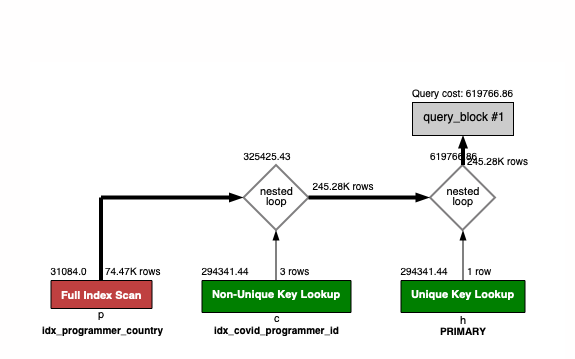
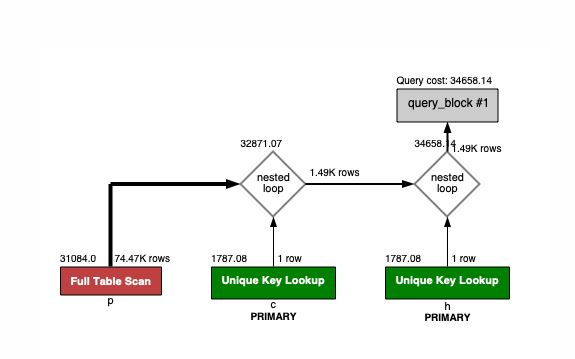
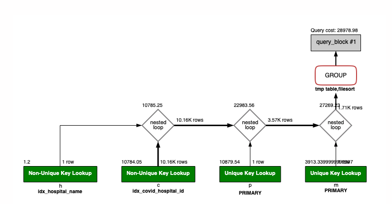
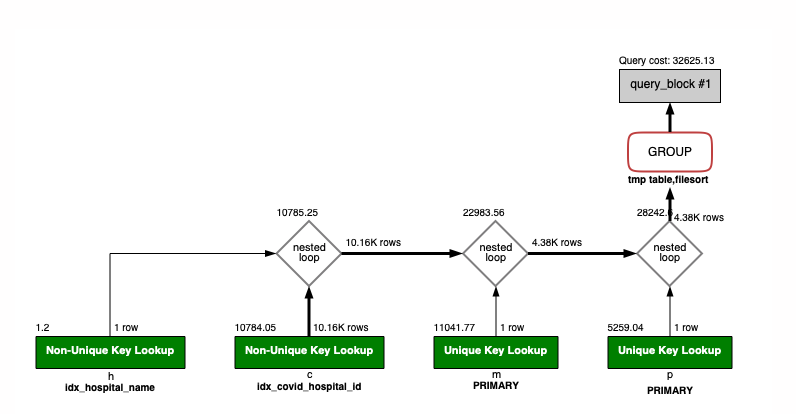

# Coding as a Hobby 와 같은 결과를 반환하세요.
## Query
```sql
SELECT hobby, COUNT(*) / (SELECT COUNT(*) FROM programmer) * 100 AS percent
FROM programmer p
GROUP BY p.hobby
ORDER BY percent DESC;
```
## Improvement
```sql
alter table programmer add primary key (id);
create index idx_programmer_hobby on programmer (hobby);
```

# 프로그래머별로 해당하는 병원 이름을 반환하세요. (covid.id, hospital.name)
## Query
```sql
 SELECT c.id, h.name
 FROM covid c
 JOIN programmer p ON p.id = c.programmer_id
 JOIN hospital h ON h.id = c.hospital_id;
```
## Improvement 
```sql
alter table programmer add primary key (id);
alter table hospital add primary key (id);
alter table covid add primary key (id);
create index idx_covid_programmer_id on covid (programmer_id);
```

# 프로그래밍이 취미인 학생 혹은 주니어(0-2년)들이 다닌 병원 이름을 반환하고 user.id 기준으로 정렬하세요. (covid.id, hospital.name, user.Hobby, user.DevType, user.YearsCoding)
## Query
```sql
select cp.id, cp.name, p.hobby, p.dev_type, p.years_coding
 from (
     select c.id as id, h.name as name
     from covid c
     join hospital h on h.id = c.hospital_id
 ) cp
 join (
     select id, hobby, dev_type, years_coding
     from programmer p
     where hobby = 'Yes' and (student like 'Yes%' or years_coding = '0-2 years')
 ) p
 on cp.id = p.id;
```
## Improvement
```sql
alter table programmer add primary key (id); 
alter table hospital add primary key (id); 
alter table covid add primary key (id); 
create index idx_programmer_hobby on programmer (hobby);
```

# 서울대병원에 다닌 20대 India 환자들을 병원에 머문 기간별로 집계하세요. (covid.Stay)
## Query
```sql
select c.stay, count(*)
from programmer p
         inner join covid c on c.programmer_id = p.id
         inner join member m on c.member_id = m.id
         inner join hospital h on c.hospital_id = h.id
where h.name = '서울대병원'
  and p.country = 'India'
  and m.age BETWEEN 20 and 29
group by c.stay;
```
## Improvement
```sql
alter table programmer add primary key (id);
alter table covid add primary key (id);
alter table member add primary key (id);
alter table hospital add primary key (id);
create index idx_covid_hospital_id on covid (hospital_id);
create index idx_hospital_name on hospital (name);
create index idx_member_age on hospital (age);
```

# 서울대병원에 다닌 30대 환자들을 운동 횟수별로 집계하세요. (user.Exercise)
## Query
```sql
 select p.exercise, count(*)
 from hospital h
          join covid c on c.hospital_id = h.id
          join programmer p on p.id = c.programmer_id
          join member m on m.id = c.member_id
 where m.age between 30 and 39 and h.name = '서울대병원'
 group by p.exercise;
```
## Improvement
```sql
alter table programmer add primary key (id);
alter table hospital add primary key (id);
alter table covid add primary key (id);
alter table member add primary key (id);
create index idx_hospital_name on hospital (name);
```

# 최종결과
## covid
- primary
- idx_covid_member_id
- idx_covid_programmer_id
- idx_covid_hospital_id
## hospital
- primary
- idx_hospital_name
## member
- primary
- idx_member_age
## programmer
- primary
- idx_programmer_country

## 실행계획







